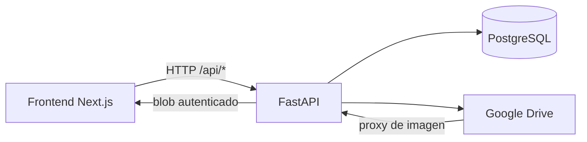
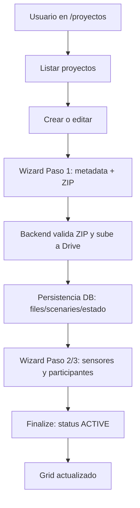

# 01 - Vision General Del Proyecto

## Que Es NeuroDatics

NeuroDatics es una plataforma para gestionar experimentos de biosenales orientados a neuromarketing.
En el estado actual del repositorio, el caso mas consolidado es la gestion de proyectos:

- Crear proyecto.
- Cargar ZIP del experimento.
- Procesar archivos del ZIP en Google Drive.
- Editar metadatos/sensores/participantes.
- Visualizar escenarios (imagenes/videos) y AOIs.
- Eliminar proyecto con limpieza en Drive.

## Stack Tecnologico

### Frontend

- Next.js (App Router).
- React + TypeScript.
- Tailwind CSS.
- shadcn UI (componentes base sobre Radix).
- Cliente API propio en `frontend/lib/api/apiFetch.ts`.

### Backend

- FastAPI.
- SQLAlchemy async.
- Alembic (migraciones incrementales).
- JWT local para auth con access token.
- Integracion Google OAuth y Google Drive.

### Base De Datos Y Storage

- PostgreSQL para estado de negocio.
- Google Drive como storage remoto de archivos de experimento.

## Conceptos De Dominio Importantes

- Project: agregado principal del dominio.
- ProjectFile: archivo fisico/logico asociado al proyecto (ZIP original, imagen escenario, video, CSV, etc).
- ProjectSensor: sensores asociados al estudio (EEG, GSR, EyeTracker).
- Participant: participante de experimento (documento, edad, sexo).
- Scenary: estimulo (image/video) asociado a un archivo.
- AOI: area de interes dentro de un escenario.
- Ingestion: pipeline de validacion + extraccion + subida + persistencia al cargar ZIP.

## Arquitectura General

## Flujo Macro De Proyectos

## Estado Real Del Proyecto (Importante)

- Frontend de proyectos esta avanzado y funcional.
- Backend de proyectos funciona y esta integrado con Drive.
- Existen modulos scaffold/placeholder en backend que no tienen el mismo nivel de cierre.
- El modelo de datos base completo no esta totalmente representado por migraciones del repo (ver brechas en [10-known-gaps-and-todos.md](./10-known-gaps-and-todos.md)).

## Siguiente Lectura

- Frontend: [02-frontend-architecture.md](./02-frontend-architecture.md)
- Backend: [03-backend-architecture.md](./03-backend-architecture.md)
- CRUD de proyectos: [04-projects-crud-flow.md](./04-projects-crud-flow.md)
