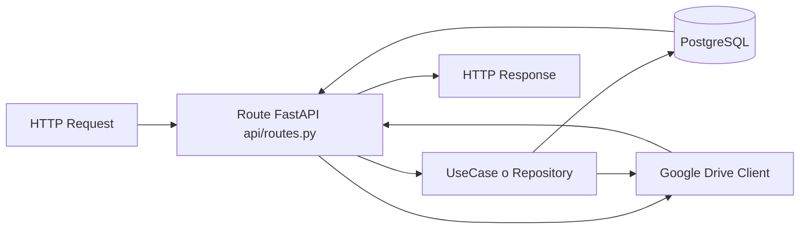

# 03 - Arquitectura Backend

## Estructura Principal

Raiz principal: `backend/src/neurodatics/`

- `main.py`: instancia FastAPI y wiring general.
- `api/`: deps compartidas, router global y middlewares.
- `config/`: settings, seguridad JWT, logging.
- `infra/`: session DB y cliente de storage.
- `modules/`: dominio por vertical (projects, participants, scenaries, auth, integrations, etc).
- `shared/`, `workers/`: soporte transversal (uso heterogeneo).

## Router Global

Archivo: `backend/src/neurodatics/api/router.py`

Incluye:
- `auth_router`
- `google_drive_integrations_router`
- `projects_router`
- `participants_router`
- `scenaries_router`

Todos bajo prefijo `/api`.

## Capas Por Modulo (Patron General)

Ejemplo fuerte: `modules/projects/`

- `api/`: rutas HTTP + schemas Pydantic.
- `application/use_cases/`: casos de uso (create/list/delete/upload zip).
- `application/services/`: validacion ZIP, extraccion, registro de progreso.
- `domain/`: entidades SQLAlchemy y contrato repository.
- `infrastructure/`: implementacion SQLAlchemy repository.

## Request Flow Basico

## Caso Particular: Imagenes De Escenarios

Endpoint:
- `GET /api/projects/{project_id}/files/{file_id}/image`

Implementacion:
- Archivo: `modules/projects/api/routes.py`

Flujo real:
1. Valida propiedad del archivo con query `ProjectFile JOIN Project`.
2. Verifica mime image y `external_id`.
3. Revisa cache en memoria por clave de archivo.
4. Si no existe cache, configura cliente Drive OAuth y descarga bytes.
5. Devuelve `Response` con `Cache-Control` + `ETag`.

Notas de arquitectura:
- Este endpoint evita cargar relaciones pesadas de proyecto.
- Usa cache local del proceso de FastAPI (no distribuida entre replicas).

## Configuracion De Seguridad

Archivo: `config/security.py`

- Emite JWT access/refresh locales.
- Verifica `iss`, `exp`, firma y tipo (`typ`).
- `get_current_user_id` extrae `sub` desde bearer token.

Dependencia usada por rutas autenticadas:
- `api/deps.py` -> `get_current_user()`

## Capa DB

Archivos:
- `infra/db/session.py`: `AsyncSessionLocal` y `get_session()`.
- `infra/db/base.py`: `BaseModel` con `created_at` y `updated_at`.

Observacion:
- `main.py` define `startup_event` con `pass`; no crea tablas automaticamente.
- El flujo esperado es via migraciones Alembic.

## Integracion Google Drive

Piezas clave:
- `modules/integrations/google_drive/application/service.py`
- `modules/integrations/google_drive/infrastructure/repository.py`
- `infra/storage/gdrive_client.py`
- `modules/integrations/google_drive/infrastructure/configure_client.py`

Roles:
- Guardar estado OAuth global en tabla `system_integrations`.
- Construir credentials OAuth con refresh token.
- Configurar cliente global de Drive.
- Operar create folder, upload file, sync folder.

Optimizacion real reciente:
- Cache temporal de configuracion OAuth (`configure_client.py`) para no reconfigurar en cada request.

## Guia Para Quien Nunca Toco FastAPI En Este Repo

1. Empieza por `main.py` para ver como arranca app y que routers registra.
2. Sigue con `api/router.py` para mapear modulos.
3. Entra a `modules/projects/api/routes.py` para entender endpoints core.
4. Desde cada ruta, baja a use case/repository usado.
5. Cruza con entidades en `domain/entities.py`.
6. Revisa migraciones en `backend/migrations/versions` para historia de esquema.

## Inconsistencias O Huecos Visibles

- En `projects/api/routes.py` existe `register_project_routes(app): pass` sin uso.
- `app_users` se usa por SQL directo en auth pero no aparece en migraciones del repo.
- `backend/README.md` mezcla comandos y partes desalineadas con estado real.

Ver detalle en [10-known-gaps-and-todos.md](./10-known-gaps-and-todos.md).
