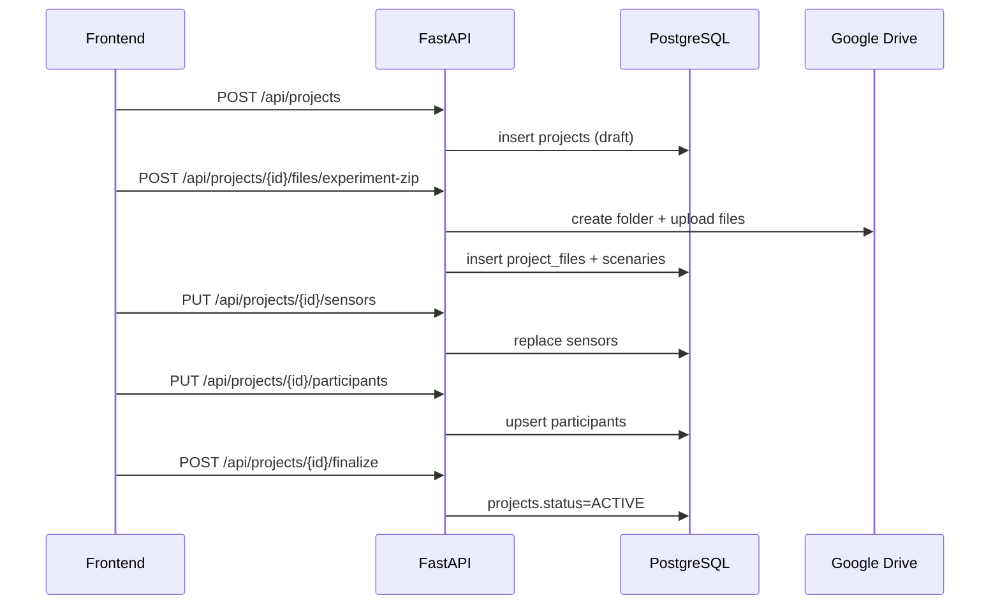

# 04 - Flujo CRUD De Proyectos (End-to-End)

Este documento describe los flujos reales de Proyectos cruzando frontend, backend, DB y Drive.

## 1) Listar Proyectos

### Frontend

- Entrada: `frontend/app/proyectos/page.tsx`
- Hook de datos: `frontend/features/projects/create-project/useProjectsStorage.ts`
- Llamada: `ProjectsApi.list()` en `frontend/features/projects/api/projectsApi.ts`
- Endpoint consumido: `GET /api/projects/`
- Render: `ProjectsGrid`

### Backend

- Ruta: `modules/projects/api/routes.py -> list_projects`
- Caso de uso: `ListProjectsUseCase`
- Repositorio: `SQLProjectRepository.get_by_owner`
- Relaciones cargadas: sensores + participantes

### DB

Tablas involucradas:
- `projects`
- `project_sensors`
- `participants`

### Resultado en UI

Se mapea a tipo `Project` con:
- `name`, `description`, `status`
- `createdAt`, `updatedAt`
- `sensors[]`
- `participants` (count)

## 2) Crear Proyecto

### Frontend (wizard)

Archivos clave:
- `CreateProjectDialog.tsx`
- `useCreateProjectWizard.ts`
- Steps `CreateProjectStep1..4.tsx`

Secuencia real:
1. Paso 1: valida nombre y ZIP.
2. Crea proyecto draft (`POST /api/projects/`).
3. Sube ZIP (`POST /api/projects/{id}/files/experiment-zip`).
4. Paso 2: sensores (`PUT /api/projects/{id}/sensors`).
5. Paso 3: participantes (`PUT /api/projects/{id}/participants`).
6. Finaliza (`POST /api/projects/{id}/finalize`) -> estado `active`.

### Backend

- Crear:
  - route `create_project`
  - use case `CreateProjectUseCase`
  - repository `create`
- Ingestion ZIP:
  - route `upload_experiment_zip`
  - use case `UploadExperimentZipUseCase`
  - services `ZipValidationService` + `ZipExtractionService`
- Sensores:
  - route `update_sensors`
  - repository `update_sensors`
- Participantes:
  - route en modulo participants `update_participants`
  - repository `SQLParticipantRepository.upsert_participants`
- Finalizar:
  - route `finalize_project`

### DB

Se escriben/actualizan:
- `projects`
- `project_files`
- `project_sensors`
- `participants`
- `scenaries`
- `aois` (si aplica)

## 3) Editar Proyecto

### Frontend

Archivo principal: `frontend/features/projects/components/EditProjectDialog.tsx`

Flujo real:
1. Al abrir, carga `ProjectsApi.get(projectId)`.
2. Si usuario marca actualizar ZIP:
   - Paso 1 reprocesa ZIP inmediatamente.
3. En guardar:
   - Actualiza metadata si cambio (`PATCH /projects/{id}`).
   - Actualiza sensores y/o participantes solo si cambiaron.
   - Ejecuta `finalize` solo si hubo reprocesamiento ZIP.

### Backend

- Detalle proyecto: `get_project`
- Update metadata: `update_project`
- Reingestion ZIP: `upload_experiment_zip`
- Sensors: `update_sensors`
- Participants: `participants/update_participants`
- Finalize condicional: `finalize_project`

## 4) Eliminar Proyecto

### Frontend

- Trigger en `ProjectsGrid` -> `DeleteProjectDialog`.
- Confirmacion de texto obligatorio: escribir `eliminar`.
- Llamada: `ProjectsApi.remove(projectId)`.

### Backend

- Ruta: `DELETE /api/projects/{project_id}`
- Use case: `DeleteProjectUseCase`
- Comportamiento:
  1. Busca proyecto.
  2. Si tiene `drive_root_folder_id`, intenta borrar carpeta en Drive.
  3. Si falla borrado de Drive, lanza error (evita inconsistencia).
  4. Borra registro DB.

## 5) Ver Proyecto (Read-Only)

### Frontend

- Dialog: `ViewProjectDialog.tsx`
- Carga detalle con `ProjectsApi.get(projectId)`
- Muestra:
  - info general
  - sensores
  - participantes
  - escenarios

### Backend

- Endpoint `GET /api/projects/{id}`
- Repositorio `get_by_id` con cargas eager:
  - files, sensors, participants, scenaries, aois

## 6) Flujo De Imagen De Escenario

### Frontend

- `CreateProjectStep4.tsx` usa `ProjectsApi.fetchScenarioImage(projectId, fileId)`.
- `apiFetchBlob` descarga blob autenticado.

### Backend

- `GET /api/projects/{project}/files/{file}/image`
- Busca archivo y propietario.
- Descarga desde Drive si no esta cacheado.
- Retorna bytes imagen con headers de cache.

## Diagrama Integrado CRUD

## Inconsistencias Detectadas Relacionadas Al CRUD

- Filtro visual de pagina proyectos no incluye boton `draft`.
- Existen dos metodos API (`remove` y `delete`) que llaman al mismo endpoint en frontend.
- Estado draft aparece en dominio y backend, pero hubo historial reciente de migraciones 013/014 que lo removieron y restauraron.
