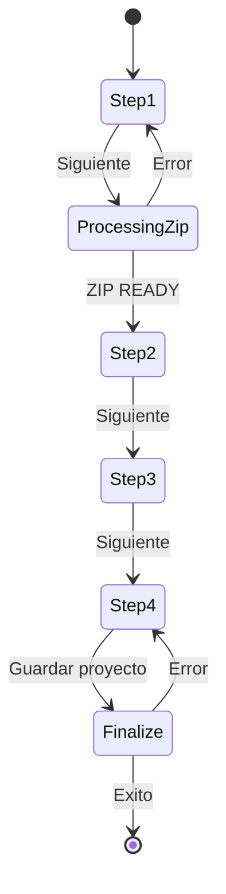

# 05 - Wizard De Creacion De Proyecto

## Objetivo Del Wizard

Guiar al usuario por 4 pasos para dejar un proyecto listo para analisis:

1. Datos basicos + ZIP del experimento.
2. Sensores.
3. Participantes.
4. Revision de escenarios (imagenes/AOIs).

## Archivos Que Lo Implementan

- `frontend/features/projects/create-project/CreateProjectDialog.tsx`
- `frontend/features/projects/create-project/useCreateProjectWizard.ts`
- `frontend/features/projects/create-project/CreateProjectStep1.tsx`
- `frontend/features/projects/create-project/CreateProjectStep2.tsx`
- `frontend/features/projects/create-project/CreateProjectStep3.tsx`
- `frontend/features/projects/create-project/CreateProjectStep4.tsx`

## Estado Interno Relevante (Hook)

En `useCreateProjectWizard.ts`:

- `currentStep`: paso actual (1..4).
- `formData`: estructura principal del wizard.
- `draftProjectId`: proyecto temporal en estado draft.
- `isSaving`, `saveError`, `saveNotice`: estado de ejecucion.
- `zipUploadPercent`, `zipUploadBytes`, `zipUploadSpeedMbps`, `zipUploadEtaSeconds`: progreso de subida y sync.
- `isZipUploadInProgress`: bandera de upload activo.

## Paso 1: Nombre + Descripcion + ZIP

UI: `CreateProjectStep1.tsx`

Validaciones UI:
- extension ZIP.
- tamano maximo hardcodeado en frontend (100MB).

Flujo al presionar Siguiente:
1. Si no hay draft, crea `POST /api/projects` con status `draft`.
2. Sube ZIP a backend `POST /api/projects/{id}/files/experiment-zip`.
3. Polling de progreso via `GET /api/projects/{id}/files/experiment-zip/progress`.
4. Si backend retorna READY, trae detalle `GET /api/projects/{id}`.
5. Construye escenarios de Step 4 con archivos tipo image.

Si falla antes de consolidar:
- intenta borrar draft (`DELETE /api/projects/{id}`) para no dejar basura.

## Paso 2: Sensores

UI: `CreateProjectStep2.tsx`

Sensores disponibles en UI:
- EEG
- GSR
- EyeTracker

Persistencia:
- No escribe inmediatamente.
- Se guarda en bloque en `saveProject()` via `PUT /api/projects/{id}/sensors`.

## Paso 3: Participantes

UI: `CreateProjectStep3.tsx`

Campos:
- participant code (id local del formulario)
- sex (male/female/other)
- age

Persistencia:
- En `saveProject()` via `PUT /api/projects/{id}/participants`.

## Paso 4: Escenarios Y AOIs

UI: `CreateProjectStep4.tsx`

Comportamiento actual:
- Muestra solo escenarios tipo `image`.
- Para cada escenario intenta obtener imagen por proxy backend autenticado.
- Renderiza AOIs existentes sobre la imagen.

Consumo de imagen:
- `ProjectsApi.fetchScenarioImage` -> `apiFetchBlob`.
- Usa cache local de blobs y deduplicacion de requests en cliente.

## Guardado Final Del Wizard

Metodo: `saveProject()`

Orden real:
1. Guarda sensores (si hay).
2. Guarda participantes (si hay).
3. Finaliza proyecto `POST /api/projects/{id}/finalize`.
4. Recarga detalle para reflejar estado final y notifica `onProjectCreated`.

## Flujo Backend Del ZIP (Paso 1)

Ruta: `projects/api/routes.py -> upload_experiment_zip`

Use case: `UploadExperimentZipUseCase`

Pipeline:
1. Valida estructura ZIP (`ZipValidationService`).
2. Marca proyecto `PROCESSING`.
3. Crea carpeta raiz en Drive.
4. Sube ZIP (opcional segun setting).
5. Extrae y sube archivos del manifiesto.
6. Crea `project_files` y `scenaries`.
7. Limpia archivos/escenarios previos del proyecto.
8. Borra carpeta root anterior en Drive (si aplica).
9. Marca proyecto `READY` y guarda metadata.

## Diagrama Wizard

## Diferencias Importantes Con Flujo Viejo

- El procesamiento de ZIP ya no se difiere al final: se hace en Paso 1.
- El estado draft existe para sostener ese flujo incremental.
- El wizard de edicion replica la misma idea cuando se decide reemplazar ZIP.
