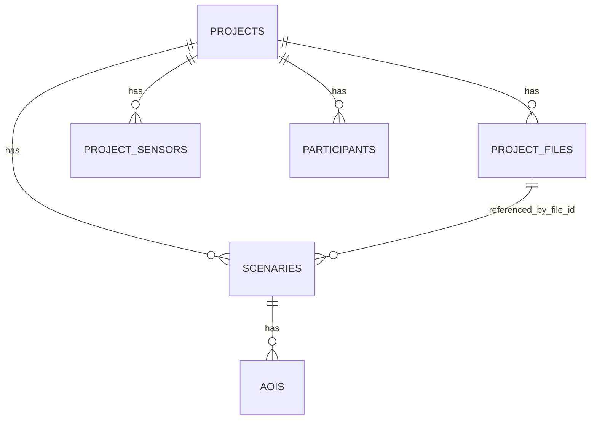

# 07 - Modelo De Datos Actual

Este modelo se reconstruye desde:
- Entidades SQLAlchemy en `modules/*/domain/entities.py`.
- Migraciones en `backend/migrations/versions`.
- SQL directo en repositorios/rutas (auth e integrations).

## Tablas Principales

## projects

Proposito:
- Agregado principal del dominio.

Campos relevantes:
- `id` (UUID)
- `owner_id` (UUID)
- `name`, `description`
- `status` (`draft|active|archived`)
- `ingestion_status`, `ingestion_error`, `last_ingested_at`
- `storage_provider`, `drive_root_folder_id`, `drive_root_folder_name`, `drive_root_folder_url`
- `created_at`, `updated_at`

## project_files

Proposito:
- Inventario de archivos del proyecto (ZIP y derivados).

Campos relevantes:
- `id`, `project_id`, `source_zip_id`
- `kind` (`experiment_zip`, `scenario_image`, `scenario_video`, `raw_csv`, etc)
- `storage_provider`, `external_id`
- `filename`, `original_filename`, `source_entry_path`
- `mime_type`, `extension`, `size_bytes`, `checksum_sha256`
- `drive_web_view_link`, `drive_download_link`
- `validation_status`, `validation_errors`
- `processing_status`, `processing_errors`, `processed_at`
- `file_metadata`, `zip_manifest`, `entry_count`, `root_folder_name`
- `deleted_at`

## project_sensors

Proposito:
- Sensores asociados al proyecto.

Campos:
- `id`, `project_id`, `sensor_type`

## participants

Proposito:
- Participantes por proyecto.

Campos:
- `id`, `project_id`, `participant_code`, `age`, `sex`

## scenaries

Proposito:
- Escenarios de estimulo vinculados a archivos.

Campos:
- `id`, `project_id`, `name`, `type`
- `file_id` (FK a `project_files.id`)
- `source_entry_path`, `width`, `height`, `fps`, `duration_ms`

## aois

Proposito:
- Areas de interes por escenario.

Campos:
- `id`, `scenaries_id`
- `name`, `color`, `shape_type`, `shape` (JSON)

## system_integrations

Proposito:
- Estado global de integraciones (actualmente Google Drive OAuth).

Fuente:
- Migracion `011_add_system_integrations_table.py`.

Campos:
- `provider` (unique)
- `account_email`, `refresh_token`, `access_token`
- `scope`, `token_type`, `expires_at`
- `metadata`, `created_at`, `updated_at`

## app_users (uso detectado por SQL directo)

Proposito:
- Mapeo de usuario de app contra identidad Google.

Uso detectado:
- `modules/auth/api/routes.py` hace SELECT/UPDATE/INSERT en `app_users`.

Importante:
- No se encontro migracion de creacion de `app_users` en este repo.

## Relaciones (Vista Simplificada)

## Decisiones De Diseno Notables

- Soft delete en `project_files.deleted_at` para reemplazo de ZIP/archivos.
- `project_files.kind` controlado por constraints y migraciones 010/012.
- `projects.ingestion_status` separa estado de ingestion de estado funcional (`status`).
- Integracion OAuth Drive se guarda globalmente en `system_integrations` (no por usuario).

## Ambiguedades O Riesgos De Modelo

- `owner_id` en `projects` comenta referencia a `auth.users(id)`, pero backend usa `app_users` por SQL directo.
- Falta evidencia de migracion inicial de tablas base en este repo.
- Parte del modelo puede existir por bootstrap externo a Alembic local.

Ver implicaciones en [10-known-gaps-and-todos.md](./10-known-gaps-and-todos.md).
