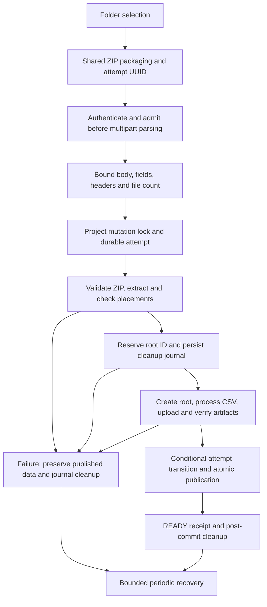

# Upload pipeline repairs and verification

Implementation review: **2026-09-12**, starting from `a6962cc`. The pre-existing edits to [UPLOAD_PIPELINE.md](UPLOAD_PIPELINE.md) are preserved as the original audit; this document records the resulting implementation, including the request to simplify tangled control flow.

## Correctness contract

An upload prepares a new generation in its own Drive root. Existing files remain authoritative until one database transaction publishes files, scenarios, detected participants/sensors, the ingestion generation and a durable completion receipt. Failure before publication retains the previous generation. Failure after publication must never delete that generation's Drive root.



## Findings addressed

| Audit area | Result |
| --- | --- |
| F1: destructive draft cleanup | Network errors, cancellation, resumed drafts and failed follow-up reads no longer trigger deletion of uploaded projects. A successful upload receipt is retained in UI state so a failed detail GET can be retried without uploading again. |
| F2: ZIP replacement foreign keys | Historical child file rows are detached from the ZIP parent before it is removed. Replacement and ZIP-only deletion no longer violate `source_zip_id`. Rollback restores both references and deletion markers. |
| F3/F4: scenario identity | Numeric-looking labels such as `001` and `1` remain strings. Colliding portable filenames receive deterministic hash suffixes. Drive names use the generated artifact basename; deduplication uses the original scenario label and rejects conflicting outputs. |
| F5/F10: cancellation and polling | Every request has an optional UUID shared by upload, progress and cancellation. Cancellation before processing survives the processing-to-Drive transition. Retries use new IDs. Shared serial polling aborts in-flight reads and clears timers on every exit; stale responses cannot revive an old attempt. |
| F6: Drive transport | Each thread owns its HTTP service and credential copy. Credential rotation invalidates services without sharing a transport across worker threads. |
| F7: request resource gates | Authentication and process-local admission run before multipart parsing. Declared and actual request bytes are bounded; individual fields, headers, file count and duplicate form fields are checked. The file itself retains its independent ZIP size cap. Ownership and the database mutation lock are checked after bounded multipart parsing. |
| F8/F9: ZIP integrity and selection | Original member names are validated before normalization. Duplicate members, path aliases, traversal, encrypted/unsupported members, manifest mismatches and exact extraction-size mismatches fail closed. Selected Acquisition defaults come only from that tree; invalid explicit selections are rejected. |
| F11: metadata consistency | Participants and sensors publish with the files. Matching participant codes retain demographics. AOIs are copied only when stimulus source path, bytes and intrinsic geometry match; changed media receives fresh annotations. Both client flows use shared metadata mapping and packaging. |
| F12: error boundaries | Invalid archives/placements do not change a previously published project's ingestion status. Failed replacements preserve READY for the existing generation and record the attempt error. Access errors use a dedicated type; unexpected failures do not expose raw exception text to clients. |
| F13: lifecycle and recovery | PostgreSQL mutation locks exclude overlapping upload, delete, finalize, metadata, participant, scenario and AOI writes. Attempt rows record outcomes, cancellation and cleanup roots. A conditional attempt transition fences publication against recovery if a worker loses its advisory connection. Reserved Drive root IDs are persisted before remote creation. |
| Storage deletion | Project and ZIP deletion commit their database change and a separate cleanup record before touching Drive. Cleanup records survive project deletion. Uncertain publication commits retain Drive data until the durable receipt can be read. |
| Upload byte integrity | Drive creates use reserved IDs and reconcile lost responses. Resumable retries query the acknowledged offset. Uploaded size and SHA-256 (or Drive's MD5 fallback) must match the source, and media streams always close. |

Cancellation is cooperative. It does not promise to interrupt a CSV parse or an individual Drive transport call immediately. A request disconnect keeps the request's database session and temporary files alive until its ingestion task finishes unwinding. A canceled attempt and a successfully committed upload are distinct outcomes, and clients must consult the receipt when the HTTP outcome is uncertain.

## Structure after refactoring

| Responsibility | Implementation |
| --- | --- |
| Shared browser attempt lifecycle | [useZipUploadAttempt.ts](../frontend/features/projects/create-project/useZipUploadAttempt.ts) |
| ZIP packaging, duplicate checks, final ZIP size and packaging cancellation | [packageExperimentFolder.ts](../frontend/features/projects/create-project/packageExperimentFolder.ts) |
| Detected metadata mapping | [uploadMetadata.ts](../frontend/features/projects/create-project/uploadMetadata.ts) |
| Receive boundary | [upload_route.py](../backend/src/neurodatics/modules/projects/api/upload_route.py) |
| Durable lifecycle, cancellation, compensation and receipt checks | [ingestion_lifecycle.py](../backend/src/neurodatics/modules/projects/application/use_cases/ingestion_lifecycle.py) |
| Atomic publication and annotation carryover | [publish_ingestion.py](../backend/src/neurodatics/modules/projects/application/use_cases/publish_ingestion.py) |
| Artifact orchestration | [upload_experiment_zip.py](../backend/src/neurodatics/modules/projects/application/use_cases/upload_experiment_zip.py) |
| Durable state, mutation exclusion and deferred deletion | [upload_attempt_store.py](../backend/src/neurodatics/modules/projects/infrastructure/upload_attempt_store.py), [mutation_lock.py](../backend/src/neurodatics/modules/projects/infrastructure/mutation_lock.py), [drive_cleanup.py](../backend/src/neurodatics/modules/projects/infrastructure/drive_cleanup.py) |
| Restart recovery | [recover_uploads.py](../backend/src/neurodatics/modules/projects/application/use_cases/recover_uploads.py) |

This removes duplicated client packaging/polling and the broad compensation branch from the main ingestion function. The browser no longer repeats server-owned metadata publication in best-effort follow-up writes. Numerical processing and protected analytical baselines remain separate from lifecycle control.

## Deployment and operations

Apply migration **022** before serving this backend. It creates `upload_attempts` and `drive_cleanup_tasks`; it does not rewrite existing project data. The checked-in Docker startup already runs `alembic upgrade head`. For a manually managed backend, run that command in its configured environment before starting the new application.

Deploy backend and frontend together to obtain UUID-scoped cancellation. Older callers can omit the ID, but only updated clients can reliably distinguish their own attempt from other historical attempts. The ID is an outcome receipt, not an automatic replay key: reusing an already-started ID returns 409, and querying progress for that ID returns its outcome. A new ingestion requires a new ID.

The API starts a recovery loop with a 60-second interval between sweeps. Each sweep considers up to 32 projects, up to 100 pending attempts per selected project, and up to 32 deletion records. Active project locks cause recovery to skip those projects. Failed cleanup updates its timestamp so one repeatedly failing object does not monopolize later batches. Recovery requires the database and configured Drive credentials; failure leaves the durable records for a later sweep.

A one-shot recovery command is also available from the backend with its normal `PYTHONPATH=src` and environment:

```console
python -m neurodatics.modules.projects.application.use_cases.recover_uploads
```

Mutation exclusion reserves one additional database connection/transaction per active project write. Capacity planning must include those connections and the normal request sessions. Lock health is checked at upload checkpoints, and publication/recovery additionally compete on the attempt row. PostgreSQL's transaction lock lifetime is documented in [Explicit Locking](https://www.postgresql.org/docs/16/explicit-locking.html).

The Drive transport design follows the SDK's [thread-safety requirement](https://googleapis.github.io/google-api-python-client/docs/thread_safety.html). Reserved IDs and resumable upload behavior follow Google's [upload guide](https://developers.google.com/workspace/drive/api/guides/manage-uploads).

## Verification and limits

The repository gate is `./verify.ps1`: backend tests and protected snapshots, Ruff, Vulture, dependency declarations, application boot, import boundaries, TypeScript, frontend unit tests, Chromium hook/component regressions and ESLint. New regressions cover early receive rejection, exact ZIP members, scenario identity, pre-receive cancellation, stale polling, draft preservation, receipt fencing, unknown commit outcomes, deletion ordering and metadata/foreign-key rollback.

Final verification on 2026-09-12: **`./verify.ps1` passed** with 672 backend tests, 24 protected snapshots, 48 frontend unit tests and 26 browser hook/component tests. All static checks passed; ESLint retained the existing six warnings and had zero errors. **`npm run build` passed**, including TypeScript validation and all 11 generated pages. Protected snapshots were not updated.

SQL replacement/metadata/outbox tests execute real SQL against SQLite with foreign keys enabled. PostgreSQL migration 022 was compiled to SQL offline. Drive retry tests exercise the installed SDK's real resumable `HttpRequest` with controlled transports. These tests do **not** substitute for a live PostgreSQL/Drive integration test.

No production database or Drive account was modified. Docker is installed here but its daemon was unavailable, so container-level uploads, real advisory-lock concurrency, live migration application, process-kill recovery and realistic peak resource use have not been exercised in this environment.

Remaining operational limits from F14–F16 are explicit:

- Uploads still use a long-lived HTTP request; browser ZIP generation and CSV parsing materialize substantial data. Archive limits are not memory or disk reservations, and the configured four-upload limit is per API process.
- Abrupt process termination can leave application temporary directories; durable recovery addresses publication and Drive cleanup, not a complete filesystem garbage collector.
- Original-ZIP retention still stores the exact archive, including excluded entries. Raw CSV retention still depends on that setting.
- Media classification/probing retains the existing fallback behavior for unknown dimensions. It is not a full media security scanner.
- Drive credentials remain a system-wide integration. This change does not redesign integration administration or perform a general dependency/security upgrade.
- Completed attempt history has no automatic retention policy. Monitor table growth and cleanup failures as part of normal operation.

Before rollout acceptance, use an isolated PostgreSQL/Drive project to verify a first upload, same-data replacement, changed participant/scenario replacement, simultaneous mutation rejection, cancellation during CSV/Drive work, lost-response lookup by ID, and worker termination before/after publication. Confirm that old data stays readable and deferred roots are reclaimed after recovery. Do not use production experiments as destructive test fixtures.
