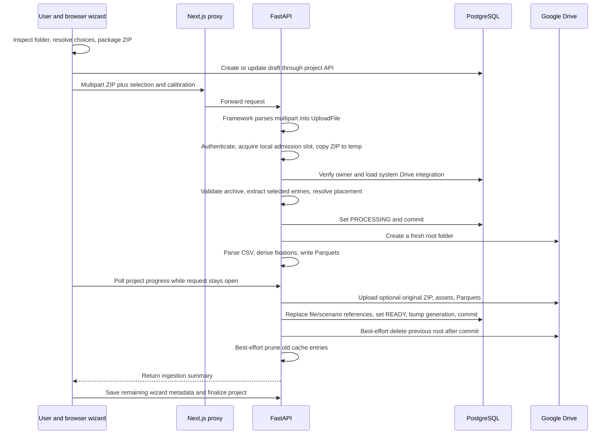

# Current experiment upload pipeline

Audited on **2026-09-06**, against commit `a6962cc2e0616683bcfb5d4d064f09247d92402d`. This document describes the checked-in implementation. The companion [proposed pipeline and repair plan](UPLOAD_PIPELINE_PROPOSED.md) describes changes that have **not** been implemented.

The review followed the browser create/edit flows, API and framework request handling, ZIP validation and extraction, CSV processing, Drive storage, database publication, cancellation, and downstream readers. Evidence comes from source inspection, existing tests, and isolated synthetic probes. It does not establish the configuration or behavior of a running production deployment.

## 1. What an upload actually does

An experiment upload takes a folder from the user's computer, packages it into one ZIP in the browser, sends that ZIP to the API, derives analytical data from its CSV, stores selected assets and derived Parquets in Google Drive, and publishes their database references. The request stays open until this work and the normal cleanup path finish.

There is **one active ingestion implementation**, used by both project creation and project editing. There is no active upload queue or worker. The historical `processing_jobs` model, repository, and migration still exist, but the upload endpoint does not create or execute those jobs. Redis currently supports analytics caching; it does not make uploads durable. The earlier RQ stub was explicitly retired; see [retirement evidence](cleanup/evidence/retired-runtime-surfaces.md).

Three kinds of state must be kept separate when reading the code:

| State | Where it lives | Meaning |
| --- | --- | --- |
| Project lifecycle: `draft`, `active`, `archived` | PostgreSQL `projects.status` | Whether the project setup has been finalized. |
| Ingestion: `PENDING`, `PROCESSING`, `READY`, `FAILED` | PostgreSQL `projects.ingestion_status` | The coarse outcome of ingestion. It is overwritten for each attempt. |
| Transfer phase and cancellation flag | Browser state and an in-memory Python registry keyed by project ID | Temporary progress for the request. There is no upload-attempt ID. |

`ingestion_generation` is a fourth, different concept: an integer identifying the currently published data for cache freshness. It advances in the transaction that publishes a successful replacement. `READY` therefore means the data publication succeeded; it does not mean the create wizard has finished saving participants, sensors, annotations, or project activation.

## 2. The end-to-end flow



The diagram shows the normal path. Error handling has exceptions described below, including an extraction failure that can set `FAILED` before the normal `PROCESSING` transition.

### 2.1 Folder discovery and user decisions

The create UI accepts a directory picker or directory drag-and-drop. It reconstructs paths for dropped files, removes hidden-file/resource-fork entries, checks the aggregate selected file size against `500 * 1024 * 1024`, and calls the shared folder-structure analyzer. These are binary MiB even though the UI and settings use “MB.”

The analyzer uses whole path components named `Images`, `Videos`, and `Acquisition`, case-insensitively. The root folder prefix is removed so paths in the UI match the intended archive paths. It inventories CSV candidates outside Acquisition, media directories, and Acquisition recording-directory names. The create flow asks the user to choose when there are several candidates, or to confirm intentionally missing image/video directories. Acquisition directory names such as `Sujet_P01_Scenario_Ad A_Rec1` can supply participant and scenario defaults.

Client choices improve the experience, but the backend repeats validation. Create and edit do not currently provide identical behavior: the edit flow still has older folder filtering and does not provide the complete clarification workflow. This matters for legitimate data-only experiments and ambiguous folders; see findings F10 and F11.

Source: [CreateProjectStep1.tsx](../frontend/features/projects/create-project/CreateProjectStep1.tsx), [folderStructure.ts](../frontend/features/projects/create-project/folderStructure.ts), and [EditProjectDialog.tsx](../frontend/features/projects/edit-project/EditProjectDialog.tsx).

### 2.2 Packaging and draft creation

The browser dynamically loads JSZip, adds files at archive-relative paths, and calls `generateAsync` with `compression: "STORE"`. It creates a ZIP `File` from the resulting Blob. STORE avoids compression work, but the full ZIP still has to be assembled before transfer. The aggregate source-size check does not include ZIP headers, so a folder at the exact limit can produce a ZIP over the server limit.

There is no streaming ZIP output, resumable browser transfer, or packaging cancellation contract. Exact browser memory amplification has not been measured: File/Blob backing storage and browser implementation matter, so a fixed “twice the folder size in heap” claim would be unjustified.

Creation obtains a project ID with `POST /api/projects/` in `draft`/`PENDING`; a resumed draft is updated. A project-name conflict returns 409. The wizard then uploads against that ID. Its error cleanup is broader than its apparent intent: some failure paths delete the project even when it was resumed or the ingestion had already succeeded. The behavior is described in F1, not treated here as a safe draft-management guarantee.

Source: [useCreateProjectWizard.ts](../frontend/features/projects/create-project/useCreateProjectWizard.ts), especially packaging and the upload/catch path.

### 2.3 Browser transfer and proxy

`apiUploadFormWithProgress` uses XMLHttpRequest for `upload.onprogress`. It attaches the bearer token, checks token expiry, handles 401 as an authentication failure, uses a 30-minute timeout, and supports an AbortSignal. Ordinary API calls use the shared fetch helper. Upload errors preserve structured response details where the caller handles them; a failed HTTP response does not itself prove that no server-side changes occurred.

The browser measures only browser-to-server transfer. Once that transfer ends, the UI changes to processing and polls the separate Drive-progress endpoint. Drive progress describes a later leg of the same request.

The same-origin Next.js proxy forwards `/api` internally. Checked-in settings are `proxyClientMaxBodySize: "550mb"` and `proxyTimeout: 30 * 60_000`. The Docker backend exposes port 8000 internally; the frontend is the published service. These settings are not an upload job timeout, disk quota, or guarantee that an upstream corporate proxy will keep the connection open for 30 minutes.

Source: [apiFetch.ts](../frontend/lib/api/apiFetch.ts), [projectsApi.ts](../frontend/features/projects/api/projectsApi.ts), [next.config.mjs](../frontend/next.config.mjs), [docker-compose.yml](../docker-compose.yml).

### 2.4 API contract and the actual receive boundary

`POST /api/projects/{project_id}/files/experiment-zip` takes multipart form data:

| Field | Purpose |
| --- | --- |
| `file` | Required ZIP payload. |
| `selected_csv_path` | Explicit archive-relative CSV choice. |
| `selected_images_folder`, `selected_videos_folder` | Explicit media directory choices. |
| `selected_acquisition_folder` | Acquisition directory used for defaults. |
| `allow_missing_images`, `allow_missing_videos` | Explicit confirmation of absent media types; default false. |
| `screen_width_px`, `screen_height_px`, `screen_width_mm`, `screen_height_mm`, `viewing_distance_mm` | Optional physical screen calibration, subject to the geometry builder's validation. |
| `stimulus_placements_json` | Placement envelopes tying selected media to acquisition-screen coordinates. |

FastAPI's installed request handler calls `await request.form()` before resolving dependencies and invoking this route. Starlette creates spooled temporary UploadFiles during parsing. Only **after that parsing** does this endpoint acquire `UploadAdmissionControl.slot(current_user)` and copy the UploadFile into its own `neurodatics-upload-*` temporary directory in 1 MiB chunks.

The application copy enforces the configured ZIP cap and returns 413 when exceeded. It avoids another archive-sized Python bytes object. It **does not** reject the original network body at the moment the cap is crossed: the multipart body has already reached framework parsing. Authentication, local admission, and project ownership also do not protect all pre-route receive/spooling costs. Ownership is checked in the use case after the application copy.

This distinction was verified against local FastAPI 0.104.1 and Starlette 0.27.0 source. Proxy buffering and peak disk usage were not measured in Docker. On a large request, framework spooling and the application's ZIP copy can coexist, followed by extracted files and generated Parquets.

Source: [routes.py:1092](../backend/src/neurodatics/modules/projects/api/routes.py#L1092), route declaration at line 1134; locally installed `fastapi/routing.py` lines 223 and 264, and `starlette/formparsers.py` lines 207 and 254.

### 2.5 Admission, ownership, and Drive configuration

Admission is process-local, protected by a threading lock. Defaults allow one active ingestion per user, four globally, and at least five seconds between starts. Rejections return 429 with `Retry-After`. The slot is released by a context manager on ordinary unwinding. This is a concurrency/rate gate, not a queue, per-project lease, storage reservation, or durable quota.

The use case loads the project by `(project_id, owner_id)`, eagerly including related files, participants, sensors, scenarios, and annotations. It then configures the global Drive client from the single `system_integrations` record for `google_drive`. This happens **before ZIP validation**. `force_refresh=True` bypasses the integration configuration cache; it does not itself force a network access-token refresh. Missing integration configuration gives 503 before the use case's main compensation block.

The normal route requires this stored OAuth connection even though the low-level Drive client has service-account fallback code. The connection is system-wide, not per project owner. Google application login and Drive authorization are separate flows. The retained Drive authorization route is authenticated; the OAuth callback uses signed, expiring state. No role distinction is enforced by that router between ordinary authenticated users and integration administrators.

Source: [upload_throttle.py](../backend/src/neurodatics/modules/projects/application/services/upload_throttle.py), [upload_experiment_zip.py:120](../backend/src/neurodatics/modules/projects/application/use_cases/upload_experiment_zip.py#L120), [configure_client.py](../backend/src/neurodatics/modules/integrations/google_drive/infrastructure/configure_client.py), [integration repository](../backend/src/neurodatics/modules/integrations/google_drive/infrastructure/repository.py), [integration routes](../backend/src/neurodatics/modules/integrations/google_drive/api/routes.py).

### 2.6 Archive validation and manifest resolution

The validator checks ZIP filename suffix, accepted declared MIME types (`application/zip` and `application/x-zip-compressed`), on-disk archive size, and central-directory limits. Limits cover declared expansion size, per-entry expansion, file count, and compression ratio. These checks are valuable bomb defenses, but declared sizes are not trusted as the sole extraction limit.

It then scans structure and resolves the requested selections. No usable CSV is a validation error. Several CSVs or several named media folders require a choice. Missing Images/Videos requires the corresponding confirmation. An optional Acquisition tree supplies defaults; it is not treated as another data CSV source.

Unresolved structure returns 409 with `detail.error = "structure_clarification_required"`, questions, answer-field names, and detected options. The endpoint does not retain a staged upload session. Answering a question therefore requires another complete ZIP request.

The selected manifest classifies image extensions as `scenario_image`, video extensions as `scenario_video`, CSV as `raw_csv`, PDF as `report_pdf`, and other files as `other_asset`. Media outside appropriately named media ancestors is demoted to an ordinary asset. Nonselected candidate CSVs/media trees and Acquisition contents are excluded from extracted individual artifacts. Direct API callers can include ordinary assets that the browser may have filtered out.

**Exclusion is not removal from the saved ZIP.** With original-ZIP retention enabled, the exact received archive is also sent to Drive. Any excluded content still present in that archive remains inside that stored ZIP. Acquisition filenames can also appear in response defaults even when their file bytes are not individually extracted.

Source: [zip_validation_service.py](../backend/src/neurodatics/modules/projects/application/services/zip_validation_service.py). Confirmed selection and duplicate-member gaps appear in F8 and F9.

### 2.7 Extraction and stimulus placement

Extraction creates `neurodatics-ingestion-*`, then writes only manifest entries under an `extracted` directory. It rejects relative paths containing `..`, leading absolute paths, and drive-style prefixes as checked by its helper. It reads members to EOF, which exercises ZIP CRC validation, and counts actual output bytes against both entry and total budgets. It never calls unrestricted `extractall`.

The pipeline resolves stimulus placement while selected media is local. An envelope must identify selected media unambiguously, agree with screen calibration, and satisfy the static placement contract. Unknown paths, incompatible calibration, ambiguous media identity, and unsupported time-varying geometry are rejected with structured 422 errors. Placement snapshots and physical calibration are carried into file metadata and analytical output.

Image/video probing records intrinsic width, height, and, where available, frame rate and duration. An unreadable media file can yield unknown dimensions rather than fail ingestion; downstream rendering may then use reference dimensions. Extension/MIME classification is not proof that a media payload is decodable or safe.

Validation/extraction and some probing execute synchronously inside the async use case. CSV processing and Drive calls are offloaded, but these earlier operations can still occupy the API event loop. Temporary directories are normally removed on scope exit; abrupt process/container termination has no application-level recovery record.

Source: [zip_extraction_service.py](../backend/src/neurodatics/modules/projects/application/services/zip_extraction_service.py), [placement resolution](../backend/src/neurodatics/modules/projects/application/use_cases/upload_experiment_zip.py#L881), [stimulus_probe_service.py](../backend/src/neurodatics/modules/projects/application/services/stimulus_probe_service.py), [coordinate contract](SCREEN_TO_STIMULUS_TRANSFORM.md).

### 2.8 CSV processing and analytical artifacts

After validation, extraction, and placement resolution, the use case commits `PROCESSING`, checks cancellation, and creates a fresh Drive root. It processes each selected raw CSV with `asyncio.to_thread(CsvProcessingService.process, ...)`. Normal structure resolution selects one CSV; the loop and response retain plural accounting.

The parser performs the following work:

1. Reads the CSV bytes into memory, decodes supported UTF encodings/Latin-1, and splits text into lines. This part is not a streaming parser.
2. Identifies recording blocks from recognized time headers and associated metadata; extracts participant codes and recording labels.
3. Chooses semicolon, tab, or comma delimiters, canonicalizes known column aliases, preserves extra columns, parses localized numbers, and validates known numeric sensor channels and time values.
4. Reads declared channel units/rates, normalizes supported units, estimates the observed time-grid rate, and records discrepancies rather than pretending the file rate and gaze acquisition rate are interchangeable.
5. Separates vendor fixation coordinates from raw gaze. Where paired raw gaze is available, runs fixation-v2; calibrated angular detection uses adaptive I-VT, with normalized-coordinate fallback where physical calibration is unavailable. It tracks resampling, detector version, warnings, coordinate space, and stimulus transformation provenance.
6. Writes a full participant-block Parquet and scenario partitions. The layout is `processed/userN/userN.parquet` and `processed/userN/escenarios/<cleaned-scenario>.parquet`.

See [FIXATION_V2.md](FIXATION_V2.md) for detector mechanics. The upload contract's responsibility is to preserve the units, identity, and provenance needed to interpret those results; scientific detection should not be silently changed as part of an upload refactor.

The processing result includes detected sensors, participant codes/block indices, generated paths, block metadata, placement snapshots, and warnings. Parquet metadata and the corresponding database file metadata retain relevant provenance. Before upload, the use case verifies that generated Parquets have participant codes and that two user blocks do not claim the same participant identity. Analytics resolves participants by code rather than database row order.

A selected CSV that cannot be processed increments failure accounting; if none process, `CsvIngestionError` prevents publication and prevents a generation bump. That check is already implemented. Conversely, success at parsing is not proof of complete scenario identity: the current generic numeric inference and lossy scenario filenames have reproduced collisions, described in F3 and F4.

The upload use case **does not persist participant or sensor rows**. It returns their detected values to the wizard, which saves them through later endpoints. Scenarios are created from uploaded media, so a CSV scenario without a matching media scenario is a separate completeness concern.

Source: [csv_processing_service.py](../backend/src/neurodatics/modules/projects/application/services/csv_processing_service.py), [fixation_detection_service.py](../backend/src/neurodatics/modules/projects/application/services/fixation_detection_service.py), [participant assertion](../backend/src/neurodatics/modules/projects/application/use_cases/upload_experiment_zip.py#L1036).

### 2.9 Drive staging and progress

Each ingestion creates a new root named from the project name, ID prefix, and UTC timestamp, optionally under `GDRIVE_FOLDER_ID`. The new root is separate from the previously published one. The request keeps a list of created Drive IDs for compensation.

The upload sequence is optional original ZIP, directory structure and selected non-CSV assets, full participant Parquets, then scenario Parquets. Raw CSV entries are counted but are not uploaded as independent files; their source bytes survive in Drive only if the original received ZIP is retained. Each stored object gets a `ProjectFile` candidate with Drive ID, path, kind, size, SHA-256, URLs, and processing metadata. Children reference the saved ZIP row through `source_zip_id`, or null when ZIP retention is disabled.

`GoogleDriveClient.upload_file` computes SHA-256 with a separate sequential disk read, then uses `MediaFileUpload` with 8 MiB chunks and `resumable=True`. The SDK request is executed to completion inside one thread call. Resumable protocol is used for that transfer, but its session/offset is not persisted by NeuroDatics, so an application restart cannot resume the upload. Default HTTP timeout is 300 seconds and request retries are five.

The progress registry starts only after CSV processing, when output sizes are known. Progress bytes update after a **whole file** succeeds, not after every Drive chunk. It holds at 99% until database publication succeeds. A large ZIP upload can therefore show no byte movement for a long time. Its speed field is named `speed_mbps`, but calculation divides bytes by `1024 * 1024`: the value is MiB/s, not megabits/s.

The global client shares its service and HTTP transport across thread-offloaded uploads. Google explicitly documents that each requesting thread needs its own `httplib2.Http` instance; concurrency is therefore a concrete implementation risk, even in a single API process. [Google client thread-safety guidance](https://googleapis.github.io/google-api-python-client/docs/thread_safety.html).

Source: [Drive client](../backend/src/neurodatics/infra/storage/gdrive_client.py), [Drive progress registry](../backend/src/neurodatics/modules/projects/application/services/drive_upload_progress_registry.py), [upload orchestration](../backend/src/neurodatics/modules/projects/application/use_cases/upload_experiment_zip.py#L324).

### 2.10 Database publication and replacement

After all uploads finish and extraction scope closes, the use case checks cancellation and performs the publication transaction:

1. Soft-delete active `project_files` rows.
2. Hard-delete historical `experiment_zip` rows.
3. Delete existing AOIs and scenarios.
4. Insert new file rows and media-derived scenarios/placements.
5. Set `READY`, clear ingestion error, update Drive root and ingestion timestamp.
6. Atomically increment `ingestion_generation`, then commit.

Repository methods used in this section flush rather than independently commit. The generation and published references consequently become visible together on successful execution. A failed publication rolls this transaction back. The earlier `PROCESSING` commit is separate.

There is a serious schema conflict in step 2: soft-deleted children still have `source_zip_id` referencing the ZIP parent. The ORM and migration define no `ON DELETE SET NULL` or cascade for that self-reference. Deleting the parent therefore conflicts with those surviving rows under the declared foreign-key semantics. A small equivalent-schema probe reproduced this constraint failure; the actual migrated PostgreSQL database was not exercised. See F2.

The code comment says the ZIP purge serves a one-ZIP-per-project unique constraint. No matching ZIP unique index was found in checked-in model/migration definitions. The deployed schema must be inspected before designing that migration; a comment is insufficient evidence that the constraint exists.

On success, the old Drive root is deleted **after commit**. Failure of that deletion or cache reclamation is logged and does not intentionally undo publication. Old-root cleanup has no durable retry record. Immediate old-root deletion can also affect a read already using a previously resolved file ID; atomic cache generation alone does not keep that remote object available.

Re-upload deletes AOIs and recreates scenario identities, including for unchanged media. Existing participant/sensor rows survive this transaction. These behaviors make re-upload a destructive metadata replacement, not just replacement of one ZIP attachment.

Source: [publication block](../backend/src/neurodatics/modules/projects/application/use_cases/upload_experiment_zip.py#L653), [repository](../backend/src/neurodatics/modules/projects/infrastructure/repository_impl.py#L105), [entities](../backend/src/neurodatics/modules/projects/domain/entities.py#L50), [source-ZIP migration](../backend/migrations/versions/007_project_ingestion_real_files.py#L95).

### 2.11 Response, wizard completion, and reads

The successful response contains project/root identifiers, `READY`, ZIP retention information, uploaded files, counters, CSV processing metadata/warnings, detected sensors and participants, selected structure, Acquisition defaults, and excluded entries. `files_uploaded` counts non-ZIP uploaded artifacts; `csv` counts source CSV entries even though they were not stored independently. These counts should not be interpreted as a complete byte/object manifest.

The create wizard uses this summary and a refreshed project detail to populate later steps. Sensors, participant demographics, scenarios/AOIs, and finalization use separate calls. Backend `POST /{project_id}/finalize` checks name, active files or READY ingestion, and at least one sensor; it does not establish participant-to-Parquet completeness. The edit flow ignores important detected metadata from the upload response and refreshes scenarios, leaving existing participant/sensor choices to later save behavior.

Analytics reads active Parquet references for a participant and resolves the project generation for cache identity. Disk Parquet cache and Redis analytical results use generation-aware keys, so failed cache pruning does not make a successful new generation read old results. Uploaded file IDs also change on replacement.

Authenticated image and preview routes resolve an active file belonging to the owner's project. Images use disk/memory caches, private cache headers and ETags; cold image downloads materialize bytes. Video preview paths use cached video/frame files and ffmpeg. These are derived read caches, not durable source storage. Media cache reclamation already exists; the previous document's blanket “unbounded caches” finding is outdated. The janitor is bounded cleanup, not a strict reservation that prevents all transient overshoot.

Source: [response schemas](../backend/src/neurodatics/modules/projects/api/schemas.py), [project routes](../backend/src/neurodatics/modules/projects/api/routes.py), [analytics infrastructure](../backend/src/neurodatics/modules/analytics/infrastructure), [media janitor](../backend/src/neurodatics/modules/projects/infrastructure/media_cache_janitor.py).

## 3. Cancellation and failure semantics

`POST /{project_id}/files/experiment-zip/cancel` verifies ownership, writes a project-keyed in-memory flag, and returns immediately. It acknowledges a request to cancel, not completion. Cooperative checks run between phases/files; they do not interrupt the current CSV thread or a Drive `execute` call. Aborting XHR alone is not a durable cancellation command.

The registry expires inactive entries after six hours. `start()` overwrites an entry and sets `cancel_requested=False`; `fail()` retains an existing cancellation flag. Because `start()` occurs after CSV processing, a cancel arriving during that processing can be erased. A retry can instead observe the canceled prior attempt at an earlier checkpoint and fail before reaching `start()`. Old terminal snapshots can also make browser polling stop before the next request starts.

The broad use-case exception handler marks registry progress failed, rolls back the current DB transaction, and attempts to delete created Drive objects in reverse order. It has no persistent journal for unknown outcomes, unfinished deletes, or a process crash. The Drive deletion method returns false on many failures; compensation does not record a durable retry for that result.

| Failure point | HTTP/result and durable effect |
| --- | --- |
| Missing/expired authentication | Authentication error; multipart parsing may already have consumed resources. |
| Local admission exhausted | 429 plus `Retry-After`; no use-case ingestion. |
| Application ZIP copy over limit | 413; application temp directory normally cleaned. |
| Project missing/not owned | 404 after receive/copy; no project ingestion. |
| Missing stored Drive connection | 503 before main validation/compensation block. |
| ZIP structure invalid or clarification needed | 400 or structured 409; rollback/rethrow without changing project ingestion fields, though an existing progress snapshot may be marked failed. |
| ZIP extraction/CRC failure | 400 at route, but `ExtractionError` is not in the no-status-change exception list: handler can write `FAILED`. |
| Placement contract failure | Structured 422; no ingestion-field publication. |
| All selected CSV processing fails | Normally 500; new Drive objects are compensated, old data generation remains, project status is marked FAILED. |
| Cooperative cancellation observed | 409; compensation attempted; status FAILED with cancellation text, not a distinct durable CANCELED state. |
| Drive/DB failure before publication | Compensation attempted; old generation preserved if transaction rollback succeeds; project normally marked FAILED. |
| Drive-root/cache cleanup failure after publication | Normally logged; READY and new generation remain. |
| Browser timeout, lost response, server death | No durable attempt record proves outcome to the browser. Work may have failed, continued, or committed; local compensation cannot cover every abrupt exit. |

Generic `ValueError` is mapped by the route to 404 access denied, even if it originates elsewhere in processing. Generic exceptions include raw exception text in the 500 response and ingestion error. Typed domain error boundaries are incomplete.

There is no durable per-project exclusion between replacement, cancellation, finalization, and project deletion. `DeleteProjectUseCase` deletes the published Drive root before deleting the project row and does not acquire an ingestion lease. A database failure after the external delete can leave references to missing storage. The ZIP-only DELETE route hard-deletes the ZIP row without deleting its Drive object and is subject to the same source-ZIP foreign-key issue.

## 4. Configuration and resource envelope

These are checked-in defaults, not observed production values.

| Setting/boundary | Default | What it controls |
| --- | --- | --- |
| Browser aggregate file limit | 500 MiB | Before ZIP overhead; hard-coded. |
| Next.js proxy body setting | `550mb` | Configured proxy body handling. |
| XHR/proxy timeout | 30 minutes | Request lifetime, not durable job lifetime. |
| `PROJECT_ZIP_MAX_SIZE_MB` | 500 | Application ZIP file size. |
| `PROJECT_ZIP_MAX_UNCOMPRESSED_MB` | 2000 | Declared archive expansion and selected extraction budget. |
| `PROJECT_ZIP_MAX_ENTRY_UNCOMPRESSED_MB` | 600 | Per-entry expansion budget. |
| `PROJECT_ZIP_MAX_ENTRIES` | 20,000 | Archive entry-count guard. |
| `PROJECT_ZIP_MAX_COMPRESSION_RATIO` | 100 | Compression-ratio guard. |
| `UPLOAD_MAX_CONCURRENT_PER_USER` / `GLOBAL` | 1 / 4 | Per-process ingestion admission. |
| `UPLOAD_MIN_SECONDS_BETWEEN_UPLOADS` | 5 | Gap between admitted starts. |
| `INGESTION_SAVE_ORIGINAL_ZIP` | true | Store exact received archive in Drive. |
| `GDRIVE_HTTP_TIMEOUT_SECONDS` / `GDRIVE_REQUEST_RETRIES` | 300 / 5 | Drive transport timeout/retries. |
| Backend Docker memory limit/reservation | 2 GiB / 512 MiB | Container memory ceiling/reservation. |
| Parquet cache TTL | 4 hours | Local Parquet freshness/retention behavior. |
| Redis analytics TTL | 900 seconds | Result-cache retention. |
| Prior Parquet generations retained / removal budget | 1 / 32 | Bounded post-ingestion reclamation. |
| Redis stale-generation deletion budget | 5,000 | Bounded invalidation work. |
| Media cache size/age/removal defaults | 2 GiB / 72 hours / 500 | Janitor thresholds and per-sweep limit. |

For capacity planning, distinguish received ZIP bytes, framework spool bytes, extracted bytes, generated Parquet bytes, browser ZIP construction, parser DataFrames/arrays, and persistent caches. Four admitted large CSV ingestions can exceed practical memory/disk capacity even if every ZIP passes the archive limits. The 2 GiB container cap turns exhaustion into a failed container; it does not ensure graceful rejection or recovery.

## 5. Findings and confidence

Priority **P0** means protect existing data or analytical identity first; **P1** means repair lifecycle/reliability boundaries next; **P2** means improve capacity, usability, or operations after the correctness contract is established. Reproduced findings used synthetic data/mocks, not production projects.

| ID | Priority | Finding and evidence | Consequence |
| --- | --- | --- | --- |
| F1 | P0 | Create wizard deletes a project on broad step-1 failure, including success followed by failed detail GET. Real React hook with mocked API reproduced `upload → DELETE draft-a`. `useCreateProjectWizard.ts:523, 620`. | A recoverable UI/network error can remove a committed ingestion or resumed draft. |
| F2 | P0 | ZIP parent purge leaves referencing soft-deleted children. Model/migration and repository confirm order; equivalent SQLite FK probe fails. PostgreSQL deployment untested. | Replacement of a previously saved ZIP can fail at publication; ZIP-only delete can fail too. |
| F3 | P0 | `A B` and `A_B` both write `A_B.parquet`; temp-data probe read the second scenario from both paths. `csv_processing_service.py:916, 922`; upload dedupe at 1081. | Silent scenario artifact overwrite and discarded output. |
| F4 | P0 | Generic numeric inference converts scenario labels `001` and `1` into one numeric identity; synthetic parser probe reproduced one partition. `csv_processing_service.py:515, 644`. | Silent merge of distinct experimental conditions. |
| F5 | P1 | Project-keyed cancellation is reset by `start()` and retained by `fail()`; direct registry probe confirms both. Browser polls before starting request. | Lost cancel, poisoned retry, stale completed/failed progress. |
| F6 | P1 | Shared global Drive service/HTTP transport used across `to_thread` calls. Source plus Google's thread-safety contract. | Concurrent users can trigger transport races; increasing worker/thread concurrency is unsafe as-is. |
| F7 | P1 | Rate/size gates occur after framework multipart parsing; source verified in installed FastAPI/Starlette. | Rejected or unauthenticated requests can still consume receive/spooling resources. |
| F8 | P1 | Duplicate ZIP members pass inventory and string-based extraction reads the last matching member. Synthetic probe: three manifest entries, two extracted-map keys. | Manifest and actual bytes disagree; ambiguous artifacts can be stored twice. |
| F9 | P1 | Selecting one Acquisition tree does not filter previously collected recordings from other trees. Synthetic two-tree probe confirmed combined defaults. `zip_validation_service.py:353, 686`. | Participant/scenario defaults can come from excluded recordings. |
| F10 | P1 | Create/edit polling intervals are not reliably cleared on rejected upload paths. Real hook probe retained one interval after network error. | Background polling and stale UI state survive failure/cancel. |
| F11 | P1 | Edit lacks create's full selection handling, ignores upload detected metadata, and backend replacement clears scenarios/AOIs but leaves participant/sensor rows. | Replacement can lose annotations or leave identities inconsistent with new data. |
| F12 | P1 | Extraction errors become FAILED despite occurring before PROCESSING; generic error mapping is overbroad. | Previous valid data can be accompanied by misleading project/error state. |
| F13 | P1 | No durable attempt, lease, artifact journal, reconciliation, or restart recovery. No coordinated delete/finalize exclusion. | Unknown outcomes, orphan folders, concurrent lifecycle races, stuck PROCESSING. |
| F14 | P2 | Whole ZIP packaging, full CSV decoding/DataFrames, synchronous extraction/probing, long open request. | Browser/server resource pressure and responsiveness degradation. |
| F15 | P2 | Original ZIP retention includes excluded entries; raw CSV otherwise has no independent retained source. | Current selection and retention semantics can surprise users and weaken reproducibility when retention is off. |
| F16 | P2 | Extension-based media trust, permissive unknown-dimension fallback, whole-image readback, raw exceptions, system-wide OAuth credentials. | Incomplete content validation, diagnostics exposure, and operational/security boundaries needing explicit treatment. |

F2 is supported by the declared schema and SQL ordering, not by a live PostgreSQL reproduction. F6 is a documented contract violation risk, not an observed cross-user data leak. F13–F16 combine source-confirmed limitations with their potential consequences; load/crash/security impact has not been measured.

### Existing safeguards to preserve

Authentication/ownership on project operations, structure clarification, bounded selected extraction and CRC checking, Drive query escaping, streaming disk-backed Drive upload, participant-code assertions, failure when every CSV fails, atomic generation publication, post-commit old-root deletion, and bounded cache reclamation already exist. These should not be presented as missing features or removed during redesign.

## 6. Verification record and limits

The primary focused backend run passed **118 tests** in 16.81 seconds, with dependency deprecation warnings:

```powershell
Set-Location backend
../.venv/Scripts/python.exe -m pytest tests/unit/test_upload_pipeline_hardening.py tests/unit/test_zip_validation_service.py tests/unit/test_upload_csv_processing_metadata.py tests/unit/test_upload_cache_generation.py tests/unit/test_upload_stimulus_placement.py tests/unit/test_parquet_participant_identity.py tests/unit/test_csv_processing_service.py tests/unit/test_fixation_v2_pipeline.py tests/unit/test_ingestion_generation_repository.py tests/unit/test_gdrive_client.py -q
```

An overlapping data-boundary run also passed 112 tests, including ingestion-unit and media-probe tests. These are overlapping suites, not 230 distinct tests. Existing tests predominantly use synthetic data and mocked repositories/Drive calls; they do not prove actual replacement transactions or remote recovery.

Additional isolated probes established the cancellation flag transitions, equivalent self-referencing foreign-key failure, scenario filename overwrite, numeric-label collapse, duplicate-member mismatch, Acquisition selection leakage, and real-hook cleanup failures. No production database or Drive objects were changed. The existing golden corpus is explicitly synthetic; no goldens were regenerated.

Not verified here: live PostgreSQL schema/index inventory, a real Drive round trip, deployed proxy limits, realistic peak memory/disk/load, process-kill recovery, and complete browser-to-Docker upload. Those gaps are explicit acceptance work in the proposed plan.

This replaces the previous current-flow narrative. In particular, OAuth setup precedes ZIP validation; UploadFile copying is not pre-parser network enforcement; extraction failures can mutate ingestion status; SHA-256 is a separate read; old Drive deletion follows commit; all-CSV failure and generation-aware cache freshness are already fixed. Historical rationale remains available in Git and the [cleanup ledger](cleanup/LEDGER.md).
