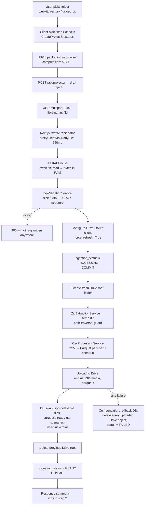

# File Upload Pipeline — End to End

Audit of how an experiment folder travels from the user's disk to Google Drive,
PostgreSQL and the analytics layer, plus an explicit account of what the pipeline
defends against and what it does not.

- **Scope**: the experiment-ZIP ingestion path (`POST /api/projects/{id}/files/experiment-zip`)
  and the media read-back path (`/files/{id}/image`, `/files/{id}/preview`).
- **Status**: reflects the code on branch `dashboard` as of 2026-08-06.
- **Audience**: developers and whoever signs off on the deployment.

---

## 1. Summary

There is exactly **one** file upload entry point in the product. It accepts a single
ZIP archive per project, validates its structure, extracts it to a temp directory,
converts the experiment CSV into Parquet, mirrors everything into a fresh Google
Drive folder, and records one `project_files` row per stored object. Ingestion runs
**synchronously inside the HTTP request** — the RQ worker task exists but is an
explicit stub.

Two other modules look like upload paths but are dead code: `modules/uploads/*`
(all placeholders — `routes.py` is `def register_upload_routes(app): pass`,
`r2_storage_adapter.py` is `class R2StorageAdapter: pass`) and
`workers/tasks/process_experiment_zip.py` (logs "stub, not implemented").

The single most serious finding in this review is unrelated to the ZIP endpoint
itself: **the entire Google Drive integration router has no authentication**, and
one of its endpoints uploads an arbitrary server-side directory to Drive. See
[§5.1](#51-critical--the-google-drive-integration-router-has-no-authentication).

---

## 2. The pipeline, stage by stage



### Stage 0 — Folder selection (browser)

[CreateProjectStep1.tsx](../frontend/features/projects/create-project/CreateProjectStep1.tsx)

A hidden `<input type="file" webkitdirectory mozdirectory>` or a directory drag-drop
(`webkitGetAsEntry()` + recursive `readDirectoryEntries`, which reconstructs a
`_relativePath` on each `File` because dropped files have no `webkitRelativePath`).

`handleFolder` then applies four client-side rules:

| Rule | Implementation |
| --- | --- |
| Drop hidden files and macOS resource forks | `!file.name.startsWith(".") && !relativePath.includes("__MACOSX/")` |
| Total size ≤ 500 MB | sum of `file.size` vs `500 * 1024 * 1024` |
| At least one `.csv` | path suffix check |
| At least one file under `Images/` or `Videos/` | `path.toLowerCase().includes("/images/" \| "/videos/")` |

It then narrows the selection to only what the backend needs — `.csv` files plus
anything under `/images/` or `/videos/` — and stores that array in wizard state.
Everything else in the chosen folder is silently discarded before packaging.

### Stage 1 — ZIP packaging (browser)

[useCreateProjectWizard.ts:268-291](../frontend/features/projects/create-project/useCreateProjectWizard.ts#L268-L291)

`jszip` is dynamically imported, each file added with its root-folder prefix stripped
so archive entries are relative (`Images/a.png`, not `MyExperiment/Images/a.png`), and
**`compression: "STORE"`** — no compression, so the ZIP is roughly the sum of input
sizes. The blob becomes a `File` named `${folderName}.zip` with type `application/zip`.

This happens entirely in browser memory. A 450 MB folder means ~900 MB of browser heap
between the source `File` objects and the generated blob.

### Stage 2 — Draft project

`POST /api/projects/` creates the project in `draft` / `ingestion_status=PENDING`
before any bytes are sent, so the upload has an ID to attach to. Name collisions per
owner return 409. On resume, `PATCH /api/projects/{id}` is used instead.

If step 1 fails and the draft was created in this attempt, the wizard deletes it
(`keepDraftOnFailure` is only set to `true` after a successful ingestion).

### Stage 3 — HTTP transfer

[apiFetch.ts:118-285](../frontend/lib/api/apiFetch.ts#L118-L285)

`apiUploadFormWithProgress` uses raw `XMLHttpRequest` (not `fetch`) purely to get
`xhr.upload.onprogress`:

- `POST` `multipart/form-data`, single part named `file`
- `Authorization: Bearer <jwt>` from the session store; token expiry is pre-checked
  client-side and a 401 forces a redirect to `/login`
- `xhr.timeout = 30 min`
- An `AbortSignal` is wired in so the wizard's cancel button aborts the XHR
- After `upload.onload`, the UI switches to a "processing" phase with a 1 s ticker,
  because the browser→backend leg finishes long before ingestion does

The request goes to the **same origin**. Next.js rewrites `/api/:path*` to
`http://backend:8000/api/:path*` with `experimental.proxyClientMaxBodySize: "550mb"`
and `proxyTimeout: 30 * 60_000` ([next.config.mjs](../frontend/next.config.mjs)). The
backend port is never published — `docker-compose.yml` uses `expose: "8000"`, not `ports`.

### Stage 4 — Backend receives

[routes.py:929-1004](../backend/src/neurodatics/modules/projects/api/routes.py#L929-L1004)

```python
file_content = await file.read()          # entire archive materialised in RAM
mime_type = file.content_type or "application/zip"
filename  = file.filename or "experiment.zip"
```

Starlette spools the multipart part to a temp file past ~1 MB, but `.read()` pulls it
all back into a single `bytes` object. That buffer is then held for the whole
ingestion and copied again in later stages.

### Stage 5 — Validation (before anything is written)

[zip_validation_service.py](../backend/src/neurodatics/modules/projects/application/services/zip_validation_service.py)

`ZipValidationService.validate_and_analyze` is deliberately the **first** thing the use
case does — before the project status changes and before any Drive call — so an invalid
archive leaves zero side effects.

1. **`validate_upload`**
   - filename must end in `.zip`
   - if a `content_type` was supplied it must be `application/zip` or
     `application/x-zip-compressed`
   - `len(file_content) ≤ PROJECT_ZIP_MAX_SIZE_MB × 1024²` (default **500 MB**)
2. **`validate_zip_integrity`** — `zipfile.ZipFile(BytesIO(...))`, must be non-empty,
   then `testzip()` runs a **CRC check over every member** (this decompresses the whole
   archive once).
3. **`build_manifest`** — for each non-directory entry: normalise the path
   (`\` → `/`, strip leading/trailing `/`), skip `__MACOSX/`, classify by extension via
   `KIND_BY_EXTENSION`, and **demote** any image/video to `other_asset` unless one of its
   parent path components is literally `images` or `videos` (case-insensitive).
4. **`validate_structure`** — at least one CSV **and** at least one image or video,
   otherwise a Spanish-language `ValidationError` that the route maps to 400.

Kind mapping: `.jpg/.jpeg/.png/.gif/.bmp/.webp/.tif/.tiff/.svg` → `scenario_image`;
`.mp4/.avi/.mov/.mkv/.webm/.m4v` → `scenario_video`; `.csv` → `raw_csv`;
`.pdf` → `report_pdf`; everything else → `other_asset`.

### Stage 6 — Drive credentials and status transition

[upload_experiment_zip.py:74-125](../backend/src/neurodatics/modules/projects/application/use_cases/upload_experiment_zip.py#L74-L125)

- `configure_gdrive_client_with_oauth(db, silent=True, force_refresh=True)` loads the
  refresh token from `system_integrations` and injects OAuth credentials into the global
  `gdrive_client`. If not connected → `GoogleDriveConfigurationError` → **503**.
- `ingestion_status = PROCESSING`, `ingestion_error = NULL`, `storage_provider = gdrive`,
  committed immediately so the UI can lock its inputs.
- A **new** Drive root folder is always created, named
  `{project.name}-{project.id[:8]}-{YYYYMMDDHHMMSS}`, parented to `GDRIVE_FOLDER_ID`
  when set, otherwise the connected account's Drive root. Re-uploading never mutates the
  previous folder — it builds a fresh one and deletes the old one at the end.

### Stage 7 — Extraction to a temp directory

[zip_extraction_service.py](../backend/src/neurodatics/modules/projects/application/services/zip_extraction_service.py)

Inside `tempfile.TemporaryDirectory(prefix="neurodatics-ingestion-")`:

- the in-memory buffer is written back out as `payload.zip` and reopened
- for every manifest entry, `_is_unsafe_relative_path` rejects absolute paths,
  Windows drive letters (`C:`), and any `..` component
- extraction is manual — `zip_file.open(rel_path)` + `shutil.copyfileobj` into
  `extracted/<rel_path>`. Nothing calls `ZipFile.extract*`, so archive-declared
  symlinks/permissions are never honoured.
- the directory (and everything in it) is removed by the context manager on exit,
  success or failure

### Stage 8 — CSV → Parquet

[csv_processing_service.py](../backend/src/neurodatics/modules/projects/application/services/csv_processing_service.py),
run per CSV via `asyncio.to_thread`.

- **Decoding**: tries `utf-16`, then `utf-8`, then `latin-1`.
- **User blocks**: the file is split at every line whose first cell normalises to
  `time`. Each block is one participant.
- **Participant code**: regex `[Gg]rabaci[oó]n\s*:\s*(\d+)` over the metadata lines
  directly above the header; falls back to `participante_{n}`.
- **Sensor detection** from the first header row: `EEG`, `GSR`, `EyeTracker`.
- **Parsing**: delimiter auto-chosen among `;`, `,`, `\t` by column count;
  `pd.read_csv(engine="python", decimal=",", on_bad_lines="skip")`; columns renamed via
  `STD_MAP`; string columns coerced to numeric when ≥80 % of non-empty values parse.
- **Cleaning**: eye-tracker blackout rows (`gx == 0 and gy == 0`) blanked except
  `time/distance/lx_pupil/rx_pupil/scenario`; negative fixations clamped to `-100`;
  single-pass sentinel propagation to the rows adjacent to original `-100` rows.
- **Output**: `user{n}.parquet` plus one `escenarios/{scenario}.parquet` per distinct
  scenario value, snappy-compressed, written under the temp dir.

A CSV that raises `CsvProcessingError` increments `csv_summary.failed` and is **skipped** —
ingestion continues. Outputs are deduped by `user_index` and by `(user_index, clean scenario name)`.

### Stage 9 — Upload to Google Drive

Progress accounting starts here: `total_bytes` = uncompressed size of all non-CSV
manifest entries + all generated Parquet sizes + the original ZIP if it will be saved.

Upload order:

1. **Original ZIP** (only if `INGESTION_SAVE_ORIGINAL_ZIP=true`, the default) →
   `ProjectFile(kind="experiment_zip")` carrying a SHA-256 and the full manifest JSON.
2. **Folder tree** rebuilt via `_ensure_folder_path`, which memoises path → Drive ID and
   reuses an existing child folder when `find_child_folder_by_name` matches.
3. **Every non-CSV manifest entry** uploaded from its extracted temp path. Images and
   videos additionally produce a `Scenaries` row named after the entry's stem.
4. **Parquets** to `processed/user{n}/user{n}.parquet` and
   `processed/user{n}/escenarios/{name}.parquet`, `kind="processed_parquet"`.

> **Raw CSVs are counted but never uploaded to Drive.** Only the derived Parquet files
> are stored. The original CSV survives only inside the archived ZIP, and only when
> `INGESTION_SAVE_ORIGINAL_ZIP` is on.

Each stored object gets a `project_files` row with `external_id` (Drive file ID),
`checksum_sha256`, `mime_type`, `size_bytes`, `drive_web_view_link` and
`drive_download_link`.

`gdrive_client.upload_file` reads the local file fully into memory
(`local_file.read_bytes()`) and wraps it in `MediaIoBaseUpload(BytesIO(payload),
resumable=True)` — resumable in the Google-API sense, but sourced from RAM.

### Stage 10 — Database swap

All in one transaction, only after every Drive upload succeeded:

```
soft_delete_active_files(project_id)      # deleted_at = now() on previous rows
purge_files_by_kind(project_id, "experiment_zip")   # hard delete — unique constraint
clear_project_scenaries(project_id)       # deletes AOIs then Scenaries
add_files(files_to_insert)
add_scenaries(scenaries_to_insert)
```

Then the **previous Drive root folder** is deleted if it differs from the new one. If
that delete fails the whole ingestion is aborted rather than reporting success with
stale remote content.

Finally `ingestion_status = READY`, `last_ingested_at`, and the three
`drive_root_folder_*` columns are written and committed;
`drive_upload_progress_registry.complete(project_id)` flips progress to 100 %.

> Note: clearing scenaries also deletes their AOIs. **Re-uploading a folder destroys all
> AOI annotations the user had drawn.** That is intentional in the current design but is
> not surfaced in the UI.

### Stage 11 — Response and wizard continuation

`UploadedProjectZipSummaryResponse` returns counts, the manifest summary, the created
file list, `detected_sensors` and `participants`. The wizard then re-fetches project
detail, auto-fills sensors and participants, **persists them immediately** (so a closed
wizard can be resumed via "Continuar"), builds step-4 image scenarios and advances to
step 2.

### Progress and cancellation channel

[drive_upload_progress_registry.py](../backend/src/neurodatics/modules/projects/application/services/drive_upload_progress_registry.py)

A module-level, thread-locked dict keyed by project ID, holding phase, bytes, percent,
speed, ETA, elapsed, error and a `cancel_requested` flag; entries pruned after 6 hours.

- `GET /files/experiment-zip/progress` — polled once per second by the wizard. When no
  live snapshot exists it deliberately reports `idle` rather than inferring `completed`
  from a historical `READY`, so a new upload never shows a false 100 %.
- `POST /files/experiment-zip/cancel` — sets the flag; the use case calls
  `_raise_if_canceled` at ~10 checkpoints (between CSVs, before each folder, before each
  file, before the DB swap) and raises `UploadCanceledError` → **409**, which then runs
  the same compensation path and marks the project `FAILED`.

Percent is capped at 99 while uploading so the bar only reaches 100 on real completion.

### Failure handling and compensation

The `except` block in `UploadExperimentZipUseCase.execute`:

1. marks progress `failed` with a user-facing message
2. `repository.rollback()`
3. deletes **every** Drive object created during this run, in reverse order
   (`uploaded_drive_ids`), best-effort with warnings
4. re-raises `ValidationError` untouched (it happened before any writes)
5. for cancellation, sets `ingestion_status=FAILED / "Upload canceled by user"`
6. otherwise sets `FAILED` + the error text, and converts Google `invalid_grant`
   into `GoogleDriveReconnectRequiredError`

Route-level status mapping: `ValueError` → 404, `UploadCanceledError` → 409,
Drive config/reconnect → 503, `ValidationError` → 400, anything else → 500.

### Read-back path (how uploaded media is served)

Uploaded media is **never** served directly from Drive to the browser. Two authenticated
proxy endpoints exist, both gated by `_load_project_file`, which joins
`ProjectFile → Project` on `Project.owner_id == current_user`:

- `GET /projects/{pid}/files/{fid}/image` — three-tier cache: disk
  (`/data/image_cache`, no TTL) → in-memory LRU (300 s TTL, 256 items, 64 MB) → Drive
  download under a per-key `asyncio.Lock` so concurrent misses download once. Responds
  with `Cache-Control: private, max-age=300`, an ETag, and an `X-Image-Cache` hit marker.
- `GET /projects/{pid}/files/{fid}/preview?time_s&scenario&participant_code` — same path
  for images; for videos it caches the source to `/data/video_cache`, resolves the
  scenario-relative timestamp against the participant's Parquet, and shells out to
  `ffprobe` + `ffmpeg` (argument list, no shell; 10 s / 45 s timeouts) to extract a
  single JPEG frame into `/data/video_frame_cache`.

Parquet is read back by `ParquetReaderService`, which downloads from Drive on a cache
miss into `/data/parquet_cache`. Every analytics route calls `_verify_ownership`.

---

## 3. Configuration surface

| Setting | Default | Effect on the pipeline |
| --- | --- | --- |
| `PROJECT_ZIP_MAX_SIZE_MB` | `500` | Hard cap on the **compressed** upload |
| `INGESTION_SAVE_ORIGINAL_ZIP` | `true` | Whether the source ZIP is archived to Drive |
| `GDRIVE_FOLDER_ID` | unset | Parent for project root folders; unset ⇒ Drive root |
| `GDRIVE_HTTP_TIMEOUT_SECONDS` | `300` | Per-request Drive timeout |
| `GDRIVE_REQUEST_RETRIES` | `5` | `num_retries` on every Drive call |
| `proxyClientMaxBodySize` (Next) | `550mb` | Proxy body cap, must stay above the ZIP cap |
| `proxyTimeout` (Next) | `30 min` | Must cover full ingestion, not just transfer |
| `ZIP_UPLOAD_TIMEOUT_MS` (client) | `30 min` | `xhr.timeout` |
| `IMAGE_/VIDEO_/VIDEO_FRAME_/PARQUET_CACHE_DIR` | `/data/*` | Unbounded on-disk caches |
| `AUTH_ACCESS_TOKEN_EXP_MINUTES` | `20160` (14 d) | Upload credential lifetime |

---

## 4. What **is** protected

1. **Authentication on every project endpoint.** Each route takes
   `Depends(get_current_user)` → `HTTPBearer` → HS256 JWT verified for signature,
   `iss`, `typ == "access"`, `exp`, and a non-empty `sub`. There is no anonymous
   upload path.
2. **Tenant isolation.** Every project read/write goes through
   `repository.get_by_id(project_id, owner_id)` or an explicit
   `Project.owner_id == UUID(current_user)` predicate, and returns **404** (not 403) for
   another user's project, so IDs are not confirmable. `_load_project_file` applies the
   same join, so media proxying cannot be used to read someone else's files.
3. **Validate-before-write ordering.** Structure validation is the first operation;
   an invalid archive produces no Drive object, no DB mutation and no status change.
   This is called out in a code comment and is genuinely honoured.
4. **Server-side size cap.** 500 MB enforced on the received bytes. The client's 500 MB
   check is UX only and is not trusted. The Next.js proxy caps at 550 MB above it.
5. **Container type allowlist.** `.zip` extension required; declared MIME must be one of
   two ZIP types when present.
6. **Archive integrity.** `testzip()` CRC-checks every member; corrupt archives are
   rejected with the offending entry name.
7. **Path traversal defence.** Absolute paths, Windows drive letters and `..` segments
   are rejected; `__MACOSX/` is skipped; extraction is manual `open()` + `copyfileobj`,
   so no symlink, hardlink or permission bit from the archive is ever applied.
8. **Content-role allowlist.** Images and videos are only treated as scenario assets when
   they sit under an `Images`/`Videos` path component; anything else is demoted to
   `other_asset`, so a stray file cannot silently become a stimulus.
9. **Integrity records.** SHA-256 stored per uploaded object in
   `project_files.checksum_sha256`.
10. **Consistent replacement.** Old rows soft-deleted, the `experiment_zip` row purged
    (DB enforces one per project), scenaries cleared and new rows inserted in a single
    transaction; the previous Drive root is deleted only afterwards, and a failed delete
    aborts rather than reporting success.
11. **Compensating deletes.** Every Drive object created during a failed run is deleted
    in reverse order, so failures do not leave orphans consuming quota.
12. **Cooperative cancellation** with ~10 checkpoints, wired to both an `AbortController`
    on the client and a server-side flag, so aborting the XHR does not leave the backend
    uploading forever.
13. **No public object storage.** Media is served only through authenticated proxies with
    `Cache-Control: private`; Drive files are not shared publicly.
14. **Drive credentials stay server-side.** The refresh token is never sent to the
    browser. Read paths build isolated per-request clients rather than sharing the
    mutable singleton.
15. **Network posture.** Backend/DB/Redis ports are unpublished (`expose`, plus an
    `internal: true` data network); the browser only ever talks to the frontend origin.
    CORS uses an explicit allowlist with `allow_credentials=False` and only
    `Content-Type`/`Authorization` headers.
16. **Production config guardrails.** `Settings.validate_production_security` refuses to
    boot with `DEBUG=true`, a known-insecure or <32-char `AUTH_JWT_SECRET`, or an
    external `DATABASE_URL` without `sslmode=require|verify-ca|verify-full`.
17. **CSRF is structurally absent.** The credential is a bearer token in a header, not a
    cookie, and `allow_credentials=False`. No CSRF token is needed.
18. **No shell injection in media handling.** `ffmpeg`/`ffprobe` are invoked with an
    argument list and bounded timeouts; filenames are passed as separate argv entries.

---

## 5. What is **not** protected

Ordered by severity.

### 5.1 CRITICAL — the Google Drive integration router has no authentication

[modules/integrations/google_drive/api/routes.py](../backend/src/neurodatics/modules/integrations/google_drive/api/routes.py)

Not one endpoint in this router declares `Depends(get_current_user)`. Every other
router in the app does. Anyone who can reach `/api` — which, behind the same-origin
proxy, means any unauthenticated visitor of the frontend host — can call:

| Endpoint | Consequence |
| --- | --- |
| `POST /api/integrations/google-drive/sync-folder?local_folder_path=/…` | **Reads an arbitrary server directory and uploads it into the connected Google Drive account.** `/data` (which holds `auth_users.json` and all caches), `/app` (source + any mounted secrets), `/etc` are all reachable. |
| `POST /api/integrations/google-drive/sync-folder-scheduled` | Same, backgrounded, with a pollable task ID. |
| `DELETE /api/integrations/google-drive` | Disconnects Drive for the whole installation — every upload and every analytics read breaks until an admin reconnects. |
| `GET /api/integrations/google-drive/status` | Leaks the connected Google account email, the granted scope and the folder ID. |
| `POST /api/integrations/google-drive/create-folder` | Arbitrary folder creation in the shared Drive account. |
| `GET /api/integrations/google-drive/sync-tasks` | Lists all sync tasks with their local paths. |
| `GET /api/integrations/google-drive/authorize` | Mints OAuth authorization URLs. |

`sync_folder_to_drive` does check that the path exists and is a directory — but never
that it is inside any permitted root. Combined with §5.10 (a full-`drive` scope token),
this is a server-filesystem exfiltration primitive requiring no credentials.

The OAuth `callback` endpoint is the one defensible exception: it validates an
HMAC-signed, TTL-bounded `state` using `auth_jwt_secret`, so it cannot be driven by an
attacker who does not also hold that secret. Every other route here needs an auth
dependency, and the connect/disconnect/sync ones arguably need an admin role that does
not currently exist in the codebase.

### 5.2 HIGH — no zip-bomb or decompression-ratio guard

Only the **compressed** size is capped. Nothing bounds:

- total uncompressed size (`sum(info.file_size)` is computed for progress, never checked)
- per-entry uncompressed size
- entry count
- compression ratio

`testzip()` decompresses every member, then `extract_to_temp` writes every member to
disk with an unbounded `copyfileobj`. A 500 MB archive of highly compressible data
expands to hundreds of gigabytes, filling the container filesystem and the shared
`neurodatics_data` volume — which also holds the database-adjacent caches and
`auth_users.json`.

The product's own client packages with `STORE` (ratio 1:1), so this requires a
hand-crafted request — which any authenticated user can make with `curl`.

**Fix shape**: reject in `build_manifest` when `sum(info.file_size)` exceeds a ceiling
(e.g. 4× the compressed cap), when any single entry exceeds a per-file limit, or when
entry count exceeds a sane maximum — all cheap, all before extraction.

### 5.3 HIGH — whole-file in-memory handling, several times over

For one 500 MB upload the backend materialises the payload at least three times:
`await file.read()` → `BytesIO(file_content)` for validation → `payload.zip` written from
the same buffer, while the original `bytes` stays referenced for the entire ingestion
(it is used again at the end for the ZIP upload and its SHA-256). On top of that,
`gdrive_client.upload_file` re-reads each extracted file fully into RAM even when handed
a `local_path`.

Compounding it: **there is no rate limit, no per-user concurrency limit, and no memory
limit on the backend container** in either compose file. A handful of simultaneous
large uploads will OOM-kill the API for everyone.

### 5.4 HIGH — ingestion runs synchronously in the request

The queue infrastructure exists (Redis, an RQ worker service, `JOB_TIMEOUT=3600`,
a `processing_jobs` table) but `process_experiment_zip_task` is a stub and nothing
enqueues it. Consequences:

- a DB session is held open for up to 30 minutes per upload
- a client disconnect does not stop the work — only the explicit cancel endpoint does
- a backend restart or crash mid-ingestion strands the project in `PROCESSING`
  **permanently**; there is no reaper, no timeout, and no way for the user to recover
  except deleting the project
- the in-flight Drive objects from a crashed run are never compensated, because
  compensation lives in the request's `except` block

### 5.5 MEDIUM — no content sniffing, no malware scanning

Type decisions come exclusively from the filename: `KIND_BY_EXTENSION[ext]` and
`mimetypes.guess_type(filename)`. The client-supplied `content_type` is trusted for the
container check. There is no magic-byte verification, no image decode/re-encode, and no
AV scan anywhere in the pipeline.

Consequences: arbitrary bytes named `payload.png` inside `Images/` are stored in Drive,
recorded with `mime_type: image/png`, and served back with that `Content-Type` from
`/files/{id}/image`. Those responses set no `X-Content-Type-Options: nosniff`, no
`Content-Disposition`, and no CSP.

Note specifically that **`.svg` is classified as `scenario_image`**. An SVG served as
`image/svg+xml` from the app's own origin is an active-content vector. Today the
frontend fetches it as a blob and renders it in ``, which neuters script execution —
but the endpoint is directly navigable with a bearer token, and nothing prevents a future
component from rendering it inline.

### 5.6 MEDIUM — attacker-supplied media reaches ffmpeg as root

`/preview` runs `ffprobe` and `ffmpeg` over uploaded video files inside the API
container. The Dockerfile declares no `USER`, so both run as **root**. Invocation is
safe from shell injection and has timeouts, but decoder vulnerabilities in ffmpeg are a
real and recurring class, and there is no seccomp profile, no dropped capabilities, no
read-only filesystem and no separate sandbox.

Also, `ffmpeg`/`ffprobe` are only installed in the backend image — a preview request on
a host missing them raises `RuntimeError("FFmpeg is not installed…")` → 503.

### 5.7 MEDIUM — unbounded on-disk caches

`/data/image_cache`, `/data/video_cache`, `/data/video_frame_cache` and
`/data/parquet_cache` are written on demand and **never evicted**. Only the in-memory
image cache is bounded (64 MB / 256 items / 300 s). The comment in
[routes.py:56](../backend/src/neurodatics/modules/projects/api/routes.py#L56) says the
disk cache is "cleared on container restart", but it lives in the `neurodatics_data`
named volume, which survives restarts.

Video sources are cached at full size, and every distinct `time_s` (rounded to 0.1 s)
produces another JPEG on disk. A user scrubbing a video timeline generates thousands of
files. Disk exhaustion is user-reachable through normal use.

### 5.8 MEDIUM — the progress registry is process-local

`DriveUploadProgressRegistry` is a module-level dict guarded by a `threading.Lock`.
That is correct for one uvicorn process and wrong the moment the deployment scales:
with multiple workers or replicas, the progress poll and the cancel request will
frequently land on a process that knows nothing about the upload — so the bar shows
`idle` and **cancel silently does nothing**. It also does not survive a restart.

The endpoints themselves do verify project ownership before returning a snapshot, so
this is a correctness/DoS-of-UX issue, not an information leak.

### 5.9 MEDIUM — raw exception text is returned and persisted

```python
detail=f"Error procesando el archivo: {e}"          # generic 500 path
```

and `ingestion_error` — set from `str(exc)` — is stored on the project and returned by
`GET /projects/{id}` and the progress endpoint. Google API error bodies, container
filesystem paths, SQL fragments and library internals can all surface in the UI. The
`invalid_grant` case is the only one mapped to a curated message.

### 5.10 MEDIUM — Drive refresh token stored in plaintext with full-account scope

`system_integrations.refresh_token` is a plain column — no encryption at rest, no KMS,
no envelope. And the requested scope is:

```python
GOOGLE_DRIVE_SCOPE = "https://www.googleapis.com/auth/drive"   # full account access
```

not `drive.file` (which would limit the app to files it created). Notably the
**service-account fallback path in `gdrive_client` does use the narrower `drive.file`** —
the OAuth path is the broad one.

So any read of that one column — a DB backup, a log dump, a future SQLi, or the
unauthenticated `/status` + `/sync-folder` combination in §5.1 — yields full read/write
access to the connected Google account's entire Drive, not just NeuroDatics data.

### 5.11 LOW — Drive query injection via ZIP folder names

[gdrive_client.py:126](../backend/src/neurodatics/infra/storage/gdrive_client.py#L126)

```python
safe_name = name.replace("'", "\\'")
query = f"... and name = '{safe_name}' and '{parent_id}' in parents"
```

Only the single quote is escaped; the **backslash is not**. A folder name inside the ZIP
ending in `\` produces `name = 'a\\'`, where the escaped quote lets the literal run on
into attacker-influenced query syntax. Folder names originate from ZIP entry paths, so
they are fully user-controlled.

Impact is bounded — the query only lists folders in the caller's Drive with a restricted
field set — but it can cause malformed-query errors (failing an ingestion) or match an
unintended folder, sending uploaded files to the wrong place within the same account.

### 5.12 LOW — no quotas, no rate limiting

Nothing caps projects per user, uploads per hour, or total bytes pushed to Drive. All
users share **one** Google Drive account, so a single user can exhaust the shared storage
quota and break ingestion for everyone. There is no `slowapi`, no reverse-proxy rate
limit in the repo, and no accounting table.

### 5.13 LOW — 14-day access tokens with no refresh or revocation

`auth_access_token_exp_minutes = 14 * 24 * 60`. There is no refresh-token rotation, no
`jti` denylist and no logout-server-side. A token captured from browser storage grants
upload and read access to that user's projects for two weeks.

### 5.14 LOW — client and server validation rules have drifted

They are intentionally duplicated, but they do not agree:

| Rule | Frontend | Backend |
| --- | --- | --- |
| Scenario folder detection | substring `"/images/"` / `"/videos/"` on the lowercased path | any **path component** equal to `images`/`videos`, case-insensitive |
| Non-media, non-CSV files | stripped before packaging | accepted and stored as `other_asset` |
| Dotfiles | stripped | accepted (only `__MACOSX/` is skipped) |
| Size check | sum of source file sizes | length of the received ZIP |

None of this is exploitable, but a direct API caller sees a materially more permissive
pipeline than the wizard suggests, and the two rule sets need to be changed together.

### 5.15 LOW — a fully-failed CSV run still reports READY

If every CSV raises `CsvProcessingError`, `csv_summary.failed` is incremented, no Parquet
is produced, and ingestion still completes with `ingestion_status = READY`. The user
sees `0/1 CSV procesados` in a green panel and only discovers the problem later, when
every analytics endpoint returns "No processed Parquet file for participant".

### 5.16 LOW — re-upload silently destroys AOI annotations

`clear_project_scenaries` deletes AOIs before scenaries on every ingestion. Editing a
project's folder wipes hand-drawn AOIs with no warning and no backup.

### 5.17 Informational

- **Checksums are write-only.** `checksum_sha256` is computed and stored but never
  re-verified against Drive, so silent remote corruption is undetectable.
- **`size_bytes` is self-reported.** It comes from the ZIP central directory
  (`info.file_size`), not from the bytes actually written — so progress totals and
  stored sizes trust the archive's own header.
- **Global mutable Drive client.** The write path reconfigures the module-level
  `gdrive_client` singleton while read paths deliberately build isolated clients. With a
  single integration the practical risk is low, but the inconsistency is a trap for a
  future multi-account feature.
- **Drive file IDs are exposed to the browser** (`external_id`, `drive_web_view_link`,
  and the `drive.google.com/thumbnail?id=` fallback in the wizard). They are not secrets
  by themselves — access still requires Drive permissions — but they are inventory
  information about the shared account.
- **TLS is out of scope of the repo.** `docs/NETWORK_DEPLOYMENT.md` assumes an external
  HTTPS reverse proxy; nothing in the code enforces HTTPS, sets HSTS, or rejects plain
  HTTP, and compose publishes frontend port 3000 directly.

---

## 6. Recommended order of work

| # | Action | Severity | Effort |
| --- | --- | --- | --- |
| 1 | Add `Depends(get_current_user)` to every Google Drive integration route; delete or root-restrict `sync-folder*` | Critical | XS |
| 2 | Cap total uncompressed size, per-entry size and entry count in `build_manifest` | High | XS |
| 3 | Narrow the OAuth scope to `drive.file`; encrypt `refresh_token` at rest | High | S |
| 4 | Move ingestion to the existing RQ worker; add a `PROCESSING` reaper for stranded projects | High | M |
| 5 | Stream the upload to a temp file instead of `await file.read()`; stream Drive uploads from disk | High | M |
| 6 | Set container memory limits; add per-user upload concurrency/rate limits | High | S |
| 7 | Magic-byte verification for images/videos; drop `.svg` or force `Content-Disposition: attachment` + `nosniff` | Medium | S |
| 8 | Add `USER` to the backend Dockerfile; drop capabilities on the container | Medium | S |
| 9 | Bound the four on-disk caches (size cap + LRU eviction) | Medium | S |
| 10 | Move the progress registry to Redis | Medium | S |
| 11 | Replace raw `str(exc)` in `detail`/`ingestion_error` with curated messages plus a correlation ID | Medium | S |
| 12 | Escape backslashes in `find_child_folder_by_name` | Low | XS |
| 13 | Fail ingestion (or mark `PARTIAL`) when every CSV fails | Low | XS |
| 14 | Warn before re-upload destroys AOIs | Low | S |

---

## 7. File map

| Concern | Path |
| --- | --- |
| Folder picker + client validation | [frontend/features/projects/create-project/CreateProjectStep1.tsx](../frontend/features/projects/create-project/CreateProjectStep1.tsx) |
| Wizard orchestration, ZIP packaging, progress polling | [frontend/features/projects/create-project/useCreateProjectWizard.ts](../frontend/features/projects/create-project/useCreateProjectWizard.ts) |
| Edit-mode re-upload | [frontend/features/projects/components/EditProjectDialog.tsx](../frontend/features/projects/components/EditProjectDialog.tsx) |
| HTTP client, XHR upload with progress | [frontend/lib/api/apiFetch.ts](../frontend/lib/api/apiFetch.ts) |
| Typed API surface | [frontend/features/projects/api/projectsApi.ts](../frontend/features/projects/api/projectsApi.ts) |
| Same-origin proxy, body size, timeouts | [frontend/next.config.mjs](../frontend/next.config.mjs) |
| Upload/cancel/progress routes, media proxy | [backend/src/neurodatics/modules/projects/api/routes.py](../backend/src/neurodatics/modules/projects/api/routes.py) |
| Ingestion orchestration + compensation | [backend/src/neurodatics/modules/projects/application/use_cases/upload_experiment_zip.py](../backend/src/neurodatics/modules/projects/application/use_cases/upload_experiment_zip.py) |
| ZIP validation and manifest | [backend/src/neurodatics/modules/projects/application/services/zip_validation_service.py](../backend/src/neurodatics/modules/projects/application/services/zip_validation_service.py) |
| Safe extraction | [backend/src/neurodatics/modules/projects/application/services/zip_extraction_service.py](../backend/src/neurodatics/modules/projects/application/services/zip_extraction_service.py) |
| CSV → Parquet | [backend/src/neurodatics/modules/projects/application/services/csv_processing_service.py](../backend/src/neurodatics/modules/projects/application/services/csv_processing_service.py) |
| Progress/cancel registry | [backend/src/neurodatics/modules/projects/application/services/drive_upload_progress_registry.py](../backend/src/neurodatics/modules/projects/application/services/drive_upload_progress_registry.py) |
| Drive SDK wrapper | [backend/src/neurodatics/infra/storage/gdrive_client.py](../backend/src/neurodatics/infra/storage/gdrive_client.py) |
| Drive OAuth connect/status/sync (**unauthenticated**) | [backend/src/neurodatics/modules/integrations/google_drive/api/routes.py](../backend/src/neurodatics/modules/integrations/google_drive/api/routes.py) |
| Credential injection into the global client | [backend/src/neurodatics/modules/integrations/google_drive/infrastructure/configure_client.py](../backend/src/neurodatics/modules/integrations/google_drive/infrastructure/configure_client.py) |
| JWT verification | [backend/src/neurodatics/config/security.py](../backend/src/neurodatics/config/security.py) |
| Settings + production guardrails | [backend/src/neurodatics/config/settings.py](../backend/src/neurodatics/config/settings.py) |
| DB entities (`Project`, `ProjectFile`) | [backend/src/neurodatics/modules/projects/domain/entities.py](../backend/src/neurodatics/modules/projects/domain/entities.py) |
| Parquet read-back | [backend/src/neurodatics/modules/analytics/application/services/parquet_reader_service.py](../backend/src/neurodatics/modules/analytics/application/services/parquet_reader_service.py) |
| Dead code — R2/uploads module | [backend/src/neurodatics/modules/uploads/](../backend/src/neurodatics/modules/uploads/) |
| Dead code — background ingestion stub | [backend/src/neurodatics/workers/tasks/process_experiment_zip.py](../backend/src/neurodatics/workers/tasks/process_experiment_zip.py) |
