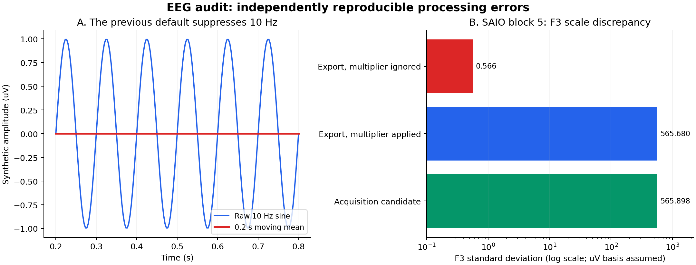

# Electroencefalógrafo: scientific audit

Audit date: 2026-09-15/16. Scope: local reference recordings, ingestion, EEG
analytics, correlation, charts and executive metrics. No recordings were uploaded,
rewritten or committed. Anonymous aggregate evidence is reproducible with
`backend/scripts/audit_eeg_references.py`; see [methods](METHODS.md).

[Anonymous source hashes and quantitative evidence](reference-evidence.json).

## Main conclusions

1. **There was a genuine scale error.** SAIO block 5 exports F3 with a `kilo`
   display multiplier. Ignoring it understates amplitude by 1,000 and power by
   1,000,000 (60 dB). Ingestion now applies that multiplier and preserves its
   provenance. The underlying physical unit is still an explicitly disclosed
   assumption where the source leaves it blank.
2. **Missing samples were being converted into plausible measurements.** PSD
   deleted missing samples before Fourier analysis; spectrograms deleted rows
   across all channels; topography interpolated arbitrarily long gaps; JSON
   serialization replaced missing values with zero. These paths now retain
   missingness and use contiguous valid windows on the original time axis.
3. **The default temporal display suppressed EEG rhythms.** A 0.2 s boxcar has
   zeros at multiples of 5 Hz, including 10 Hz. The default view and comparison
   chart now use raw values. Optional smoothing remains visibly described.
4. **Data quality limits survive correct mathematics.** Offsets, transients,
   undocumented downsampling, coarse export quantization and uncertain timing
   cannot be resolved by changing a plot. They are reported, not silently cleaned.

## Reference inventory

IDs below correspond to the audit JSON, sorted by local relative path. They are
file/block indices, not participant identities. Realidad exports are variants
of one recording, not independent participants.

| Input | Data | Result |
|---|---|---|
| csv-01 | Gaze-only reference, 8 blocks / 28,999 rows | No EEG; retained as ingestion control |
| csv-02/03/04 | Three DSI native raw CSVs | Malformed delimiters; rejected by ordinary importer |
| csv-05 | Realidad 300 Hz export, 27,425 rows | Uniform observed grid 300.313802806 Hz |
| csv-06 | Realidad 60 Hz export, 5,491 rows | Uniform observed grid 60.119497098 Hz |
| csv-07 | Realidad native-rate multisensor export | Independent clocks and malformed rows; rejected |
| csv-08 | SAIO multisensor, 6 blocks / 232,195 rows | Uniform observed grid 300.332067676 Hz |

The audit exercises PSD, spectrogram and topography on **76 EEG block/scenario
combinations**, including short and blank-label segments. A short segment may
correctly return no estimate. Across the eight usable EEG blocks (two export
variants plus six SAIO blocks), there are no repeated entire seven-channel EEG
vectors and no internal missing EEG spans. Missing EEG occurs at recording edges:

| Input/block | Missing EEG rows | Details |
|---|---:|---|
| Realidad 300 | 604 | 395 leading, 209 trailing; 26,821 valid |
| Realidad 60 | 126 | 80 leading, 46 trailing; 5,365 valid |
| SAIO 1–6 | 1,222 / 1,345 / 1,204 / 1,376 / 1,216 / 1,259 | Edges only; 224,573 valid rows total |

These shared export rows include times outside EEG acquisition. A zero-filled
trace at those times would be false. General gap handling is still necessary
for future recordings and for nonadjacent occurrences of the same scenario.

## Scale and precision: SAIO F3, block 5

The export states `kilo`. Its original F3 range is **−0.97 to 9.64**, median
**−0.21**, SD **0.5656804**. A corresponding acquisition-file candidate has F3
range **−989.8113 to 9,646.6904**, median **−212.4663**, SD **565.8978**.
The factor-of-1,000 interpretation is supported by both source metadata and the
independent acquisition values; those ranges are not evidence of exact temporal
alignment between every exported and acquired sample.

Multiplication fixes scale, **not lost precision**: two decimals in kilo units
produce steps of 10 base units. The source has 4,632 identical adjacent F3 values,
versus 115 in the acquisition candidate. Do not interpret corrected exported F3
as an equally precise channel for small rhythms or hemispheric comparisons.
Re-export that channel at the base scale with adequate precision, preferably
from the original EDF or a correctly formatted native file.

## Recording artifacts and timing limitations

- SAIO block 3 contains single-step changes of **750.54** on C4 and **713.23**
  on C3; block 4 P4 reaches **556.92**. These are candidates for transient
  artifacts. The CSV alone cannot distinguish movement, electrode contact,
  saturation, physiology or an upstream export operation.
- Channel medians can be hundreds or thousands of assumed microvolts; e.g.
  Realidad F3 **−1,742.06** and SAIO block 6 C3 **2,397.41**. A voltage offset
  is reference dependent. Removing a segment mean does not remove arbitrary
  drift, eye movements, muscle activity or mains interference.
- The 60 Hz export has Nyquist **30.05975 Hz**. Its EEG metadata still declares
  approximately 300 Hz acquisition. No anti-alias filter specification accompanies
  that export. Gamma 30–45 Hz is unavailable, and lower-band spectra remain
  conditional on the exporter's filtering. Prefer the native-rate export.
- The Realidad acquisition candidate spans approximately **299.999727 Hz**,
  while its exported time grid is **300.313803 Hz**. Do not replace one clock
  with the other without a documented synchronization transform.
- SAIO trigger values are all zero. Scenario labels support broad condition
  separation, but do not independently establish stimulus onset latency or
  event-related-potential alignment. Hardware/software markers can provide an
  alignment basis in future acquisition. [Wearable Sensing timing documentation](https://support.wearablesensing.com/faq/triggers/questions/trigger-types.html).

## Native files requiring different handling

The three raw DSI files declare 15 columns but contain 23 comma-delimited fields:
the first eight numeric values use unquoted decimal commas. A permissive table
reader can shift columns silently. The diagnostic script reconstructs this exact
known layout **only for auditing**, with an exact header/field-count guard.

Their lengths are 980, 18,040 and 3,436 rows. All have **40 distinct EEG rows
sharing the initial timestamp** (39 nonpositive intervals). Reconstructed ADC
sequences are continuous modulo 256, ADC status is zero, and the Pz reference
column is zero. These observations do not prove artifact-free acquisition, but
do distinguish a timestamp/export problem from obvious sequence-number loss.
Sorting or deduplicating would discard distinct measurements. Obtain a corrected
export or implement a separately validated native importer using sample counters
and an explicit startup policy.

The native multisensor CSV has repeated Time/channel pairs. Its clocks belong
to different sensors; there are also rows with excessive trailing delimiters.
The general importer now rejects multiple Time columns with a specific error.
A future importer must preserve per-sensor clocks and align events explicitly.

Binary acquisition inspection assumes little-endian float32 records containing
time, seven EEG channels and trigger in numbered `*_DSI.dat` files. This is a
diagnostic inference supported by ranges/cadence and cross-file comparisons,
not a vendor-supported production format declaration. The unrelated `DSI.dat`
container files are not decoded using that assumption.

## Software corrections

| Area | Corrected behavior |
|---|---|
| Import | Normalize declared V/mV/uV/nV and verified `kilo`; preserve scale/rate metadata; exclude unknown-unit channels from quantitative estimates |
| Timing | Preserve order; reject ambiguous chronology for spectral estimates; split windows at missing time, gaps, irregular intervals and condition transitions |
| PSD | Welch on finite contiguous runs; average run spectra by actual window count; preserve precision; expose linear integrated band power |
| Spectrogram | Channel-specific missing windows, actual timestamps, raw density default, optional explicitly identified normalization/smoothing |
| Topography | No temporal interpolation; mean removal inside each window; stable schematic electrode positions independent of channel selection |
| Temporal summaries | Full-resolution valid-sample statistics before display reduction; mode-specific raw/smoothed summaries; no invented baseline/Pico % |
| Correlation | Fixed channel set, complete samples and minimum bin coverage; no artificial power changes from dropping a channel |
| Displays/API | Nulls remain gaps; time-aware spectrogram rendering; quality/provenance notices; raw default; versioned cache keys |
| Reports | Raw EEG comparison traces; physical band-power metrics replace means of normalized spectrogram pixels |

## How to use the results

**Existing stored projects need re-ingestion** to receive EEG unit correction and
acquisition metadata. No existing recording or database was rewritten. New cache
versions prevent reuse of the previous algorithm's JSON, but cannot repair old
parquet values whose unit metadata was never stored. Older inputs are marked as
having assumed uV units; verify/re-import them before quantitative comparisons.

For academic analyses, record hardware, physical calibration, reference montage,
acquisition and export filter settings, mains frequency, bad channels/spans,
stimulus markers and an explicit baseline interval. Use native precision; inspect
artifacts before selecting a documented filter/rejection policy. No diagnostic,
emotion, attention or source-localization claim follows from these plots alone.

## Verification policy

Known-amplitude sinusoids test peak frequency, Parseval mean-square energy,
Hann spectral density, alpha integration and amplitude/dB scaling. Other tests
cover gaps, independent channel availability, invalid clocks, local DC removal,
band limits, scale persistence and channel-dropout correlations.

Existing golden files were **not regenerated**. Historical smoothed-trace and
report representations are checked with explicit compatibility parameters. Old
PSD values are compared after undoing their logarithmic representation. Changed
topography/defaults are checked against analytical oracles and explicit v2
contracts. Additive metadata is verified separately from the preserved HTTP
shape snapshots. This is a reviewed numerical change, not snapshot replacement.

### Completed checks

`verify.ps1` finished **ALL GREEN**: 770 backend tests, 24 preserved snapshots,
49 frontend utility tests, 36 browser hook/component tests, TypeScript and
backend/frontend quality gates. The EEG browser case passed. Full ingestion
acceptance also passed for the original 14 participants and 110 scenario parquet
files. A final spectrogram-gap refinement passed 47 focused EEG tests. See
the [change log](../CHANGELOG.md) for the verification summary; logs are under `output/`.
