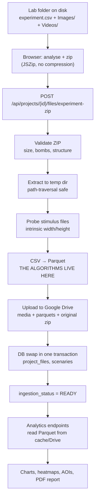

# 1. The data pipeline, end to end

One CSV file, followed from the user's laptop to a chart on screen.

---

## 1.1 The map



Stage G is where every algorithm in this study pack runs. Everything before it
is plumbing and safety; everything after it is reading and rendering.

**Important architectural fact:** stages D→J run **synchronously inside the HTTP
request**, not in the background worker. The Redis + RQ worker service exists and
runs, but `process_experiment_zip_task` is an explicit stub. If asked, this is a
known limitation, tracked in `UPLOAD_PIPELINE.md` §5.4.

---

## 1.2 What the input actually looks like

A single CSV holds **several participants** ("recordings"), each with its own
metadata header, its own column set and its own sampling rates. Simplified:

```csv
Grabación: 1001014126
Nombre: Bandwidth / X
Frecuencia: 60
Unidad Tobii: %
Nombre: Bandwidth / Y
Frecuencia: 60
Unidad Tobii: %
Nombre: Electroencefalografía (EEG) / F3
Frecuencia: 300,313802515981
Frecuencia del archivo: 300,313802515981
Time;Electroencefalografía (EEG) / F3;GSR / GSR;Bandwidth / X;Bandwidth / Y;Bandwidth / LeftEyePupilDiameter;Bandwidth / Distance;Fixations / X;Fixations / Y;Scenario 1
0,000;12,4;3,52;48,21;51,03;3,41;612;48,2;51,0;Scenario 1
0,003;13,1;3,52;48,23;51,00;3,41;612;48,2;51,0;Scenario 1
0,007;11,9;3,53;0;0;;613;-100;-100;Scenario 1
...
Grabación: 1001014127
Nombre: Bandwidth / X
...
```

Everything difficult about this file is visible in those ten lines:

| Feature | Why it is hard |
| --- | --- |
| `Grabación:` markers | One file = many participants. Blocks must be split correctly. |
| Spanish accents, `Electroencefalografía` | Encoding may be UTF-16, UTF-8 or Latin-1; accents may or may not be present. |
| `;` separator, `0,003` decimals | European locale. A naive `read_csv` reads `0,003` as text. |
| `Frecuencia: 60` vs `Frecuencia del archivo: 300.31` | **The eye tracker runs at 60 Hz but the file is exported at 300 Hz.** Each gaze value is repeated ~5×. |
| `0;0` gaze pair | Blackout / signal loss sentinel, not a real look at the top-left corner. |
| `Fixations / X = -100` | Vendor's own fixation output, with its own sentinel. |
| `Scenario 1` column | Which stimulus was on screen. Data must never mix across scenarios. |

---

## 1.3 The seven transformations, in order

Implemented in
[csv_processing_service.py](../../backend/src/neurodatics/modules/projects/application/services/csv_processing_service.py)
and
[fixation_detection_service.py](../../backend/src/neurodatics/modules/projects/application/services/fixation_detection_service.py).

| # | Step | Input → Output | Detail in |
| --- | --- | --- | --- |
| 1 | **Decode** | bytes → text (UTF-16 / UTF-8 / Latin-1) | [02](02-csv-parsing.md#21-decoding) |
| 2 | **Split into blocks** | one file → N participants | [02](02-csv-parsing.md#22-splitting-into-recording-blocks) |
| 3 | **Normalise columns** | `Bandwidth / X` → `gx` | [02](02-csv-parsing.md#23-column-normalisation-and-aliases) |
| 4 | **Parse + validate** | text cells → typed, monotonic table | [02](02-csv-parsing.md#25-numeric-parsing-and-hard-validation) |
| 5 | **Resolve sampling rates** | 3 candidate rates → 1 effective rate | [02](02-csv-parsing.md#26-the-three-sampling-rates) |
| 6 | **Detect fixations** | `time, gx, gy` → events + 5 duration variants | [03](03-fixation-detection.md) |
| 7 | **Write Parquet** | one table → `user{n}.parquet` + per-scenario files | [02](02-csv-parsing.md#28-parquet-output) |

Steps 4 and 6 are where the interesting decisions are. Step 4 **fails loudly**
(it refuses malformed data rather than repairing it). Step 6 **is conservative**
(it under-reports rather than inventing attention).

---

## 1.4 A worked example — one 300 Hz file, 60 Hz eye tracker

Take a recording exported at 300.31 Hz where the eye tracker actually samples at
60 Hz, and follow one candidate fixation.

**Raw rows (Δt ≈ 3.33 ms):**

```
row 0   t=0.0000  gx=48.21  gy=51.03      valid
row 1   t=0.0033  gx=48.21  gy=51.03      valid   (same gaze value, repeated)
row 2   t=0.0067  gx=48.21  gy=51.03      valid   (repeated)
row 3   t=0.0100  gx=48.21  gy=51.03      valid   (repeated)
row 4   t=0.0133  gx=48.21  gy=51.03      valid   (repeated)
row 5   t=0.0167  gx=48.25  gy=51.10      valid   (new eye-tracker sample)
...
row 61  t=0.2033  gx= 0.00  gy= 0.00      INVALID (blackout — zero pair)
```

**Naive approach** (what a first implementation would do): count 61 rows,
divide by 300.31 Hz, report a 203 ms fixation built from 61 "observations". Both
numbers are wrong — there were only ~12 independent eye-tracker samples, and the
blackout row is not gaze at (0, 0).

**What NeuroDatics does:**

1. **Validity mask** — row 61's `(0, 0)` pair is marked invalid
   (`gaze_invalid_reason = "signal_missing"`). It can never carry a fixation.
2. **Rate resolution** — declared gaze rate 60 Hz, observed grid rate 300.31 Hz.
   `effective_rate = min(60, 300.31) = 60 Hz`. Because
   `300.31 > 60 × 1.05`, the flag `resampled = true` is set.
3. **Resample for detection only** — gaze is binned into 60 Hz bins; each bin
   takes the **median** of the valid rows that land in it. The five identical
   rows collapse into one detector sample. EEG, GSR, pupil and distance columns
   are **not** touched — they keep their own 300 Hz rows.
4. **Detection** — I-DT runs on the 60 Hz view. Suppose it accepts 12 bins.
5. **Duration** — `12 samples / 60 Hz = 200 ms`. Not 203 ms of wall clock, and
   not `61 / 300.31`.
6. **Projection back** — the event's centroid is written to every original row
   that fed those 12 bins, so the Parquet keeps all 61 rows and stays aligned
   with EEG and GSR. The event also records:
   - `fixation_detector_sample_count = 12` (what the detector saw)
   - `fixation_source_row_count = 60` (original rows it covers)
   - `fixation_effective_rate_hz = 60.0`

**Why this matters in the presentation:** those two counts are the honest answer
to "how do you know it is really 200 ms?" — the duration is reconstructible from
stored metadata (`12 / 60 = 0.200 s`), and every consumer of the number
(histogram, AOI dwell, heatmap weight, scanpath radius) uses the same value.

---

## 1.5 What comes out

For every participant block:

```
user1/
  user1.parquet                     # every row, every sensor, + detector output
  escenarios/
    Scenario_1.parquet              # rows where scenario == "Scenario 1"
    Scenario_2.parquet
```

The per-scenario files exist because almost every analytic is scoped to one
stimulus, and reading a pre-filtered file is far cheaper than filtering a whole
recording on every request.

The Parquet is **additive**: the original `gx` / `gy` are preserved untouched
for auditability, and the detector's output is added as new columns. Nothing is
overwritten, so a disputed result can always be recomputed from the source
values in the same file.

Roughly 40 columns are written. The important ones:

| Group | Columns |
| --- | --- |
| Source signals | `time`, `gx`, `gy`, `gsr`, `le/f3/f4/c3/c4/p3/p4/trg`, `lx_pupil`, `rx_pupil`, `distance`, `scenario` |
| Vendor (audit only) | `vendor_fix_x`, `vendor_fix_y` |
| Detector output | `fix_x`, `fix_y`, `fixation_id`, `fixation_segment_id`, `fixation_detector_sample_count`, `fixation_source_row_count`, `fixation_effective_rate_hz`, `fixation_min_duration_ms` |
| Variants | `fix_x__100ms`, `fixation_id__150ms`, … (4 extra durations × 5 columns) |
| Validity | `is_valid_gaze`, `gaze_invalid_reason` |
| Coordinates | `gaze_x_screen_px`, `gaze_y_screen_px`, `gaze_x_stimulus_norm`, `gaze_y_stimulus_norm`, `is_in_viewport`, `is_in_stimulus` |
| Provenance | `fixation_method`, `fixation_detector_version`, `fixation_source`, `stimulus_transform_status/version/fingerprint`, `fixation_warnings` |

---

## 1.6 Priority rules — what wins when sources disagree

This is the question most likely to come up. The rules, in order:

1. **Raw gaze beats vendor fixations.** `Fixations / X` and `Fixations / Y` from
   the tracker are renamed `vendor_fix_x` / `vendor_fix_y`, stored, and never
   used as input. They are audit evidence only. Rationale: they are already
   interpolated and smoothed by the acquisition software, so using them would
   mean presenting somebody else's filter as our result.
2. **The slower clock wins.** `effective_rate = min(eye_rate, grid_rate)`. You
   can never have more independent observations than the slowest clock provides.
3. **Detector metadata beats re-measurement.** When rebuilding a duration in the
   analytics layer, `detector_sample_count / effective_rate` is used first; only
   if that metadata fails three consistency checks does it fall back to
   measuring row intervals.
4. **Invalid beats valid.** If a sample fails *any* validity rule it is invalid,
   full stop. It gets no fixation ID, keeps `(-100, -100)`, and contributes no
   duration.
5. **Reject beats clip.** A coordinate outside `[0, 1]` is discarded, never
   pulled to the nearest edge. Clipping would manufacture attention on a border
   the participant never looked at — and that border would then win AOI hits and
   heatmap weight.
6. **Ambiguity beats guessing.** Two scenarios that normalise to the same name,
   two Parquets claiming the same participant, an ambiguous ZIP structure — all
   return an error asking the user to disambiguate, rather than picking one.
7. **A V2 export with zero events means zero events.** It never silently falls
   back to the legacy estimator to produce something to show.

---

## 1.7 Where the time goes

| Stage | Typical cost | Notes |
| --- | --- | --- |
| Browser zip | seconds | `STORE` (no compression) — CPU-cheap, so the ZIP ≈ folder size |
| Transfer | minutes for 500 MB | streamed in 1 MB chunks to a temp file |
| Validation | < 1 s | reads the ZIP central directory only, decompresses nothing |
| CSV → Parquet | **the bulk** | runs in `asyncio.to_thread`, one CSV at a time |
| Drive upload | minutes | resumable, 8 MB chunks, progress polled once per second |
| Analytics request | 50 ms – 2 s | Redis hit ≈ instant; cold Parquet means a Drive download |

Only the first analytics request per participant is slow: the Parquet is cached
on disk (`/data/parquet_cache`, 4 h TTL) and computed responses are cached in
Redis (15 min TTL). Both caches are keyed by an **ingestion generation** counter,
so re-uploading a project makes every old cache entry unreachable instead of
serving stale numbers.
