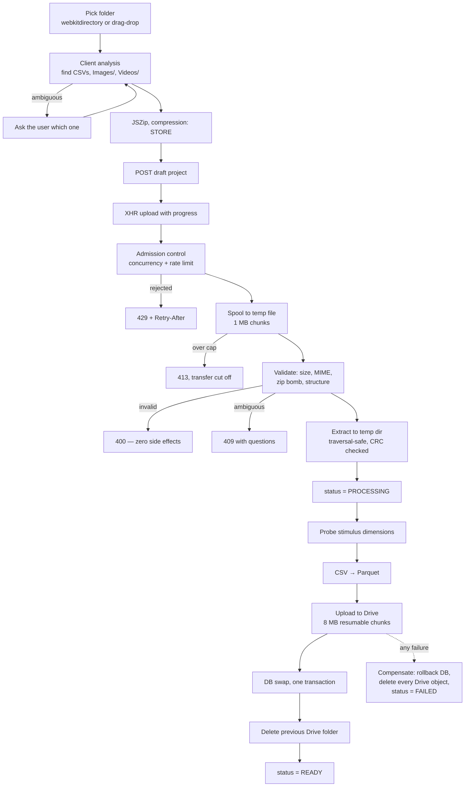

# 6. Tech stack and system flows

Broad understanding, deliberately not exhaustive. Enough to answer questions
confidently and know where to look if you have to dig.

---

## 6.1 The stack at a glance

```
Browser
  │  HTTPS (same origin)
┌─▼──────────────────────────────────────────────────────┐
│ frontend    Next.js 16 · React 19 · TypeScript          │  port 3000 (published)
│             Tailwind 4 · shadcn/Radix · Recharts        │
│             also acts as the reverse proxy for /api     │
└─┬───────────────────────────────────────────────────────┘
  │  internal Docker network only
┌─▼──────────────────────────────────────────────────────┐
│ backend     FastAPI · Python 3.11 · SQLAlchemy 2 async  │  expose 8000 (never published)
│             pandas · numpy · scipy · pyarrow            │
│             matplotlib · Pillow · ffmpeg                │
└─┬────────────┬────────────┬─────────────────────────────┘
  │            │            │
┌─▼────────┐ ┌─▼────────┐ ┌─▼──────────────┐
│PostgreSQL│ │  Redis   │ │  Google Drive  │
│    16    │ │    7     │ │ (object store) │
│ metadata │ │cache+queue│ │ files+parquets │
└──────────┘ └──────────┘ └────────────────┘
                  │
            ┌─────▼─────┐
            │  worker   │  RQ, same image as backend
            └───────────┘
```

Five containers, one `docker compose up -d --build`. Three networks:
`app` (frontend ↔ backend), `egress` (worker → internet), and `data` marked
`internal: true` so Postgres and Redis have no route out.

---

## 6.2 Why each piece

| Choice | Reason | Honest trade-off |
| --- | --- | --- |
| **FastAPI** | Async I/O suits a workload dominated by waiting on Drive and Postgres. Pydantic v2 gives request/response validation and OpenAPI docs for free. | Blocking CPU work must be pushed to `asyncio.to_thread` explicitly, or it stalls the event loop. |
| **pandas + numpy + scipy** | The research team prototyped in Jupyter with exactly this stack. Same code, same numbers, no reimplementation risk. `scipy.signal` supplies Welch and spectrogram; `scipy.ndimage` supplies the Gaussian filters. | pandas is memory-hungry; a very large recording is held whole in RAM. |
| **Parquet + PyArrow** | Columnar: an EEG request reads 2 of ~40 columns. Typed once. Snappy compression. Arbitrary JSON metadata in the schema. | Not human-readable; you need a tool to inspect one. |
| **PostgreSQL** | Metadata is genuinely relational (users → projects → files/participants/scenarios → AOIs) and needs transactions. JSONB holds the variable `file_metadata`. | — |
| **Redis** | Two jobs: analytics response cache (15 min TTL) and the RQ job queue. | The queue is currently unused for ingestion (the task is a stub). |
| **Google Drive** | Zero infrastructure cost, the university already has accounts, and files stay inspectable by researchers outside the app. | Shared quota across all users; OAuth tokens expire; one broad `drive` scope. A findings-tracked weakness. |
| **Next.js 16** | App Router + server components, and its rewrite feature lets it act as the API proxy so the backend port is never published. | — |
| **Recharts** | Declarative React charting, adequate for time series and matrices. | Heavy for very dense traces — hence server-side decimation to 5 000 points. |
| **Docker Compose** | Reviewers and graders run one command. No Node, Python, Postgres or Redis on the host. | Not an orchestrated production deployment. |

---

## 6.3 The upload pipeline

The most complex flow in the product. Full audit in
[../UPLOAD_PIPELINE.md](../UPLOAD_PIPELINE.md).



### The five ideas worth explaining

**1. Validate before you write anything.** Validation *and* extraction happen
before the project status changes and before the first Drive call. An invalid,
ambiguous, corrupt or oversized archive leaves **zero** side effects — no Drive
object, no DB row, no status change. This is an explicit ordering constraint in
the code, not an accident.

**2. Ask instead of guess.** If the archive has three CSVs, or two folders named
`Images`, ingestion stops with **409** and a machine-readable list of questions,
each naming the form field that answers it and the options available. The client
re-sends the same archive with the answers filled in. Guessing would silently
analyse the wrong file.

**3. Streaming everywhere.** The multipart body is spooled to a temp file in 1 MB
chunks, aborting with **413** the moment the running total passes the cap — an
oversized body is cut off mid-transfer, never buffered. Validation, extraction
and the Drive upload all work from that path. Peak memory for a 500 MB upload is
one chunk, not 1.5 GB.

**4. Defence in depth against zip bombs.** `enforce_archive_limits` reads only the
central directory (entry count, per-entry size, total size, compression ratio) —
it decompresses nothing. But the central directory is attacker-controlled, so
extraction **re-counts the bytes that actually come out** and aborts if an entry
exceeds its declared size or the run exceeds the budget. Reading each member to
EOF also makes `zipfile` verify its CRC, so the separate `testzip()` pass — which
decompressed the whole archive a second time — was removed.

**5. Compensating transactions.** There is no distributed transaction across
Drive and Postgres. Instead every Drive object created during a run is tracked,
and on failure they are deleted in reverse order, the DB is rolled back, and the
project is marked `FAILED`. Cancellation is cooperative: a flag is checked at
~10 checkpoints, so aborting the browser request actually stops the server work.

### Known limitations (say these before you are asked)

- **Ingestion is synchronous.** A backend crash mid-ingestion strands a project
  in `PROCESSING` permanently — no reaper, no timeout.
- **The progress registry and admission control are process-local**
  (a module-level dict + `threading.Lock`). Correct for one uvicorn process,
  wrong the moment you scale out.
- **No content sniffing.** File type comes from the extension only. `.svg` is
  accepted as a stimulus image.
- **On-disk caches are unbounded** — `/data/{image,video,video_frame,parquet}_cache`
  grow without eviction.
- **The Drive refresh token is stored in plaintext** with the broad `drive`
  scope rather than `drive.file`.

All are tracked with severities and a recommended order of work in
`UPLOAD_PIPELINE.md` §5–6. Knowing your own weaknesses is a stronger position
than being surprised by them.

---

## 6.4 Authentication and tenancy

- **Google OAuth 2.0 is the only login method.** There is no password anywhere in
  the codebase — `GET /api/auth/google/login-url` and
  `POST /api/auth/google/authorize` are the only two auth endpoints. Identities
  are persisted in a JSON user store (`AUTH_USER_STORE_PATH`, default
  `/data/auth_users.json`).
- The backend issues its own **HS256 JWT**, verified for signature, `iss`,
  `typ == "access"`, `exp` and a non-empty `sub`.
- A **bearer token in a header**, never a cookie, and CORS runs with
  `allow_credentials=False`. CSRF is therefore structurally absent — there is no
  ambient credential a cross-site request could ride on.
- **Every** project read and write goes through
  `get_by_id(project_id, owner_id)` or an explicit
  `Project.owner_id == current_user` predicate, and returns **404** rather than
  403 for someone else's project, so IDs cannot be probed.
- Google Drive is a **separate** OAuth grant (the app's own service integration),
  stored server-side in `system_integrations`. The refresh token never reaches
  the browser.
- Token lifetime is 14 days with no refresh rotation and no server-side logout —
  a known weakness.

---

## 6.5 Reading data back

```
GET /api/projects/{id}/analytics/scanpath?participant_code=1001014126&scenario=Scenario 1
        │
        ├─ verify ownership (404 if not yours)
        ├─ read ingestion_generation from the project row (already loaded)
        ├─ Redis lookup: analytics:screen-stimulus-v2:{project}:{gen}:{participant}:{endpoint}:{scenario}
        │     └─ HIT → return immediately
        ├─ resolve the participant's Parquet:
        │     1. file_metadata.participant_code            ← exact, current
        │     2. file_metadata.block_metadata.participant_code  ← transitional
        │     3. legacy positional user{n}.parquet         ← only if unambiguous
        ├─ disk cache /data/parquet_cache (4 h TTL) → else download from Drive
        ├─ compute (the algorithms in file 05)
        ├─ write to Redis (15 min TTL)
        └─ return JSON + provenance headers
```

**Two things worth calling out.**

*Identity, not position.* Parquets carry the participant code in their metadata,
so resolution never depends on database row order. When it cannot resolve to
exactly one file — duplicate codes, a mix of identified and unidentified files,
a count mismatch — it raises a descriptive error telling the user to re-upload,
instead of returning a plausible wrong participant's data.

*Generation-scoped caches.* Every cache key contains the project's
`ingestion_generation` counter. Re-uploading bumps it, which makes every previous
entry unreachable in one step — no scan, no race, and no chance of serving the
old upload's numbers. A background sweep prunes stale generations, keeping the
current one and one below it so a request that resolved just before the swap
still completes.

**Media is never served from Drive to the browser.** Two authenticated proxy
endpoints stand in the middle: `/files/{id}/image` (three-tier cache: disk →
in-memory LRU → Drive, with a per-key lock so concurrent misses download once)
and `/files/{id}/preview` (video frame extraction via `ffprobe` + `ffmpeg`,
invoked with an argument list and bounded timeouts — never a shell string).

---

## 6.6 API surface

All under `/api`, all authenticated except the OAuth callback.

| Router | Purpose |
| --- | --- |
| `auth` | Google login URL + OAuth code exchange (the only two auth endpoints) |
| `projects` | CRUD, ZIP upload, upload progress/cancel, media proxy, sensors, finalize |
| `participants` | Participants of a project |
| `scenaries` | Scenarios (stimuli) and their AOIs |
| `analytics` | ~25 endpoints — everything in file 05 |
| `reports` | Executive PDF generation |
| `integrations/google-drive` | Connect / status / disconnect (+ public OAuth callback) |

Analytics endpoints worth naming in a demo:

```
/timeseries/{pupil,gaze,distance,gsr,eeg}     /statistics/{...}
/psd/eeg     /spectrogram/eeg     /topography/eeg
/fixations   /fixations/histogram   /fixations/sensitivity
/scanpath    /heatmap (PNG)         /aois
/correlations    /comparison/charts    /gaze-at
```

Swagger UI is served through the proxy at `http://localhost:3000/docs`.

---

## 6.7 Frontend

```
app/            Next.js App Router pages
  proyectos/    project list + creation wizard
  dashboard/    the analytics dashboard
  reportes/     report generation
features/       feature-sliced modules: analytics, auth, home, projects, reports
components/     shared shadcn/Radix UI primitives
lib/            api client, auth store, config, providers
```

Three details worth knowing:

- **`apiUploadFormWithProgress` uses raw `XMLHttpRequest`, not `fetch`** — solely
  because `fetch` still has no upload progress event. A 30-minute timeout and an
  `AbortSignal` wire the wizard's cancel button through to the server.
- **`next.config.mjs` rewrites `/api/:path*` to `http://backend:8000`** with
  `proxyClientMaxBodySize: "550mb"` (above the 500 MB ZIP cap) and a 30-minute
  `proxyTimeout` (which must cover the whole ingestion, not just the transfer).
  This is why the backend port is never published to the host.
- **`folderStructure.ts` deliberately mirrors the server's `ZipValidationService`**
  so the wizard asks the same clarification questions the backend would answer
  409 with. The backend remains the authority and re-runs every rule — the client
  copy is UX, never trust.

---

## 6.8 Reports

`executive_report_service.py` (~2 000 lines) builds a PDF executive summary:
selected participants and scenarios, per-scenario metrics, embedded chart images
and AOI tables. It reuses the same analytics services, so the PDF and the
dashboard cannot disagree.

---

## 6.9 Operations

```powershell
docker compose up -d --build     # start / rebuild everything
docker compose ps                # health of all five services
docker compose logs -f backend   # follow one service
docker compose down              # stop, keep data
docker compose down -v           # stop and DESTROY volumes
```

| Concern | Implementation |
| --- | --- |
| Migrations | Alembic, run automatically on backend start |
| Health | `/health` (liveness) and `/health/ready` (checks Postgres + Redis, 503 if not) |
| Memory | `mem_limit: 2g` on backend and worker — one oversized upload fails a request instead of OOM-killing the API for everyone |
| Config | One root `.env`; `.env.example` documents the full contract |
| Production guardrails | `Settings.validate_production_security` refuses to boot with `DEBUG=true`, a weak or short `AUTH_JWT_SECRET`, or an external `DATABASE_URL` without `sslmode` |
| TLS | Out of scope of the repo — assumes an external HTTPS reverse proxy |

---

## 6.10 Testing

`backend/tests/unit/` covers the interesting parts: CSV processing, fixation
detection, the V2 pipeline end to end, fixation event analytics, ZIP validation,
upload hardening, executive reports.

```powershell
Set-Location backend
poetry run pytest -q
```

Frontend has `node --test` unit tests for chart interaction and geometry, plus
Playwright E2E specs for the comparison dashboard.
